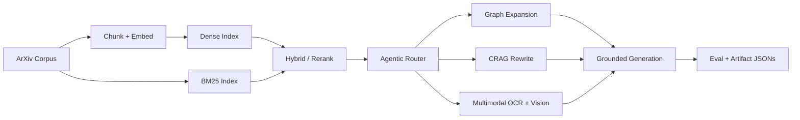

# Agentic RAG ArXiv Research Assistant

Production-style RAG tutorial and reference implementation that moves from naive retrieval to hybrid, agentic, graph-based, and multimodal systems with committed artifacts.

Current reference baseline is **4,000 papers** and legacy **600-paper** metrics are preserved for historical comparison.

## Start Here

### Student Path

1. Read [What Is This Project](docs/01_getting_started/what_is_this_project.md)
2. Follow [Installation](docs/01_getting_started/installation.md)
3. Use [Learning Tracks](docs/01_getting_started/learning_tracks.md)
4. Execute notebooks in [Tutorial Index](docs/01_getting_started/tutorial_index.md)

### Recruiter Path

1. Read [Recruiter Brief](docs/07_results/recruiter_brief.md)
2. Verify numbers in [Benchmark Table](docs/07_results/benchmark_table.md)
3. Inspect evidence links in [Claims Traceability](docs/08_reference/claims_traceability.md)
4. Download handbook PDF: [agentic-rag-full-tutorial.pdf](docs/assets/agentic-rag-full-tutorial.pdf)

## Architecture At A Glance



## Techniques Implemented

1. Naive RAG (`notebooks/01_naive_rag.ipynb`)
2. Advanced RAG (`notebooks/02_advanced_rag.ipynb`)
3. Agentic RAG with LangGraph (`notebooks/03_agentic_rag_langgraph.ipynb`)
4. GraphRAG variants (`notebooks/04_graph_rag.ipynb`)
5. Hybrid RAG (`notebooks/05_hybrid_rag.ipynb`)
6. GraphRAG (`notebooks/06_graphrag.ipynb`)
7. Agentic RAG (`notebooks/07_agentic_rag.ipynb`)
8. Corrective RAG / CRAG (`notebooks/08_crag.ipynb`)
9. Multimodal RAG (`notebooks/09_multimodal_rag.ipynb`)

Executed notebooks are available as `notebooks/*.executed.ipynb`.

## Evidence Snapshot (Artifact-Backed)

### Current 4,000 baseline

| System | Artifact | Recall@5 | Precision@5 | MRR | Notes |
|---|---|---:|---:|---:|---|
| Naive Dense (NB01) | `artifacts/eval_results/01_naive_rag_4000.json` | 0.0500 | 0.0100 | 0.0167 | Dense FAISS baseline |
| Advanced (NB02) | `artifacts/eval_results/02_advanced_rag_4000.json` | 0.0500 | 0.0100 | 0.0167 | Hybrid + reranker configuration |
| Agentic CRAG (NB03) | `artifacts/eval_results/03_agentic_rag_4000.json` | 0.0000 | n/a | 0.0000 | Faithfulness rate 0.8, web-search rate 0.8 |
| Hybrid RAG (NB05) | `artifacts/rag_v2/hybrid/05_hybrid_metrics.json` | 0.0000 | 0.0000 | 0.0000 | Retrieval latency P50/P95: 166.96 / 175.30 ms |
| GraphRAG (NB06) | `artifacts/rag_v2/graphrag/06_graphrag_metrics.json` | 0.0000 | 0.0000 | 0.0000 | Graph: 4,000 papers, 78 entities, 2,644 edges |
| Agentic RAG (NB07) | `artifacts/rag_v2/agentic/07_agentic_metrics.json` | n/a | n/a | n/a | Route stats + faithfulness traces |
| CRAG (NB08) | `artifacts/rag_v2/crag/08_crag_metrics.json` | n/a | n/a | n/a | Rewrite/correction metrics |
| Multimodal RAG (NB09) | `artifacts/rag_v2/multimodal/09_multimodal_metrics.json` | n/a | n/a | n/a | OCR + vision pipeline metrics |

### Legacy 600 baseline

| System | Artifact | Recall@5 | Precision@5 | MRR |
|---|---|---:|---:|---:|
| Naive Dense | `artifacts/eval_results/legacy_600/01_naive_rag_legacy_600.json` | 0.2500 | 0.1200 | 0.2992 |
| BM25 Improved | `artifacts/eval_results/legacy_600/02_advanced_rag_legacy_600.json` | 0.3667 | 0.1900 | 0.4408 |

## Engineering Rigor

- Reproducible artifacts committed under `artifacts/` for metric traceability
- Dual-baseline reporting to avoid accidental cross-scope metric claims
- Honest limitation reporting in [Reading the Numbers Honestly](docs/07_results/reading_the_numbers.md)
- Documentation QA scripts for stale paths, fact checks, and secret-pattern scanning

## Quick Start

```bash
git clone https://github.com/pypi-ahmad/agentic-rag-arxiv-research-assistant.git
cd agentic-rag-arxiv-research-assistant

uv python install 3.13.13
uv venv --python 3.13.13
source .venv/bin/activate
uv pip install -r requirements.txt

# Core models
ollama pull qwen3-embedding:0.6b
ollama pull granite4.1:8b

# Optional models used in extended notebooks
ollama pull qwen3-embedding:4b
ollama pull qwen3.5:4b
ollama pull glm-ocr
```

## Full Tutorial PDF

- Canonical handbook: [docs/assets/agentic-rag-full-tutorial.pdf](docs/assets/agentic-rag-full-tutorial.pdf)
- Rebuild locally:

```bash
uv run python scripts/build_tutorial_pdf.py
```

## Documentation

- Docs home: [docs/index.md](docs/index.md)
- Tutorial index: [docs/01_getting_started/tutorial_index.md](docs/01_getting_started/tutorial_index.md)
- Recruiter brief: [docs/07_results/recruiter_brief.md](docs/07_results/recruiter_brief.md)
- Claims traceability: [docs/08_reference/claims_traceability.md](docs/08_reference/claims_traceability.md)

## Documentation QA

```bash
uv run python scripts/check_docs_integrity.py
uv run python scripts/check_docs_facts.py
uv run mkdocs build --strict
```
