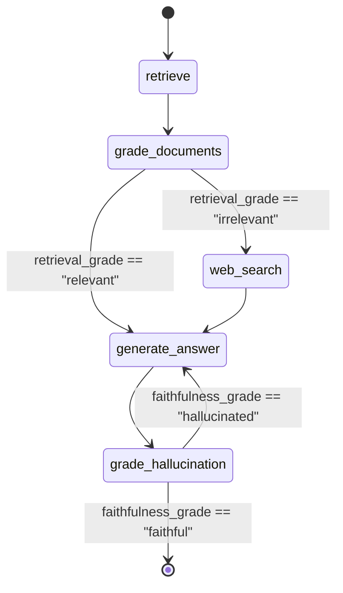
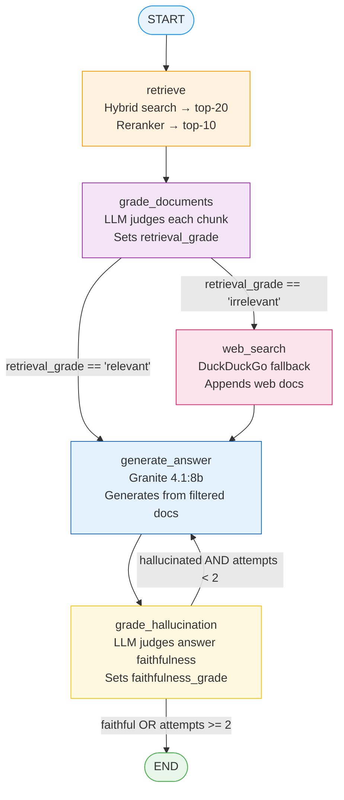

# Agentic AI and LangGraph

Parts 1 and 2 of this tutorial build *pipelines*: a fixed sequence of steps that
runs the same way every time. Part 3 builds something different — an *agent* that
decides what to do next based on what it has seen so far. This chapter explains the
key concepts before you write a single line of agentic code.

---

## What Makes Something "Agentic"?

The word "agentic" is overused in AI marketing. Here is a precise definition that
covers what we actually build:

!!! info "Definition — Agentic AI"
    A system is *agentic* when the **output of an LLM call determines control flow**.
    Instead of "always do A then B then C," the system does "do A, then ask the LLM
    what comes next, and follow its decision."

Compare a pipeline to an agent:

| | Pipeline (Parts 1 & 2) | Agent (Part 3) |
|---|---|---|
| Control flow | Fixed sequence | LLM decides next step |
| Handles bad retrieval | Silently returns noise | Detects it, takes corrective action |
| Handles hallucination | No check | Detects it, regenerates |
| Can use web search | No | Yes, when local retrieval fails |
| Predictable execution path | Yes | No — depends on query + LLM judgment |

The key word in the definition is *control flow*. An LLM call that just produces text
is not agentic. An LLM call whose output is `"relevant"` or `"irrelevant"` — and those
two values route the system down different paths — *is* agentic.

---

## State Machines: The Mental Model

Before touching LangGraph, build the right mental model: an agent is a **state machine**.

A state machine has three things:

1. **State** — a snapshot of everything the system knows at this moment (the user's
   question, the documents found so far, the LLM's last answer, etc.)
2. **Nodes** — functions that read the current state, do some work, and return a
   partial update to the state
3. **Edges** — connections between nodes, either fixed ("always go from A to B") or
   conditional ("go from A to B or C, based on a function of the current state")



Each node transition potentially changes the state. The conditional edges look at
the state to decide where to go. This is the core loop of every agent.

---

## LangGraph: State Machines for LLM Agents

LangGraph is a Python library that implements this state machine pattern cleanly.
Its three core building blocks map directly to the mental model above.

### TypedDict State

The state is a `TypedDict` — a Python type annotation that gives names and types to
every field in the shared state bag. Any node can read any field. Nodes return dicts
containing only the fields they updated.

### StateGraph

`StateGraph(MyState)` creates the graph and knows the shape of the state. You then
add nodes and edges:

```python
from langgraph.graph import StateGraph, END

graph_builder = StateGraph(GraphState)
graph_builder.add_node("retrieve", retrieve)          # fixed nodes
graph_builder.add_node("grade_documents", grade_documents)

graph_builder.add_edge("retrieve", "grade_documents") # fixed edge

graph_builder.add_conditional_edges(                  # conditional edge
    "grade_documents",
    route_after_grading,           # function: state → next node name
    {
        "generate_answer": "generate_answer",
        "web_search": "web_search",
    }
)
```

`add_conditional_edges` takes three arguments: the source node, a routing function
that maps state → node name string, and a dict translating those strings to actual
node names (this indirection lets you rename nodes without updating the routing logic).

---

## CRAG: Why the Original RAG Loop Fails

Parts 1 and 2 build a "fire and forget" pipeline: retrieve → generate. It has two
known failure modes.

**Failure mode 1 — bad retrieval silently poisons the answer.**
If the top-5 chunks returned by the retriever are all off-topic, the LLM is handed
useless context. It will either produce a vague answer ("The provided context does not
mention...") or hallucinate plausibly. There is no mechanism to notice this and try
something else.

**Failure mode 2 — the LLM hallucinates despite good retrieval.**
Even when relevant documents are in the context, LLMs sometimes ignore them and
generate from their training weights. In creative tasks this is a feature; in a
factual research assistant it is a bug.

**CRAG** (Corrective Retrieval-Augmented Generation) adds two LLM-as-judge steps:

1. **Grade retrieved documents**: for each retrieved chunk, ask an LLM "is this
   relevant to the query?" If too few are relevant, fall back to web search.
2. **Grade the generated answer**: after generation, ask an LLM "is this answer
   faithful to the context?" If not, loop back and regenerate.

The key insight is that the LLM is both the generator *and* the quality gatekeeper.
An LLM is far better at judging relevance than any heuristic.

---

## The GraphState TypedDict

Here is the complete state structure used in notebook 03:

```python title="notebooks/03_agentic_rag_langgraph.ipynb — GraphState"
from typing import TypedDict

class GraphState(TypedDict):
    question: str           # the user's original query — never modified
    documents: list         # raw retrieval output (top-20 chunks)
    filtered_documents: list  # after grading — only chunks judged relevant,
                              #   or web search results if retrieval failed
    retrieval_grade: str    # "relevant" | "irrelevant"
                            #   set by grade_documents, read by router
    generation: str         # the LLM's answer text
    faithfulness_grade: str # "faithful" | "hallucinated"
                            #   set by grade_hallucination, read by router
    generation_attempts: int  # incremented each time generate_answer runs;
                              #   caps retries at MAX_REGENERATIONS=2
    execution_trace: list   # append-only log of every node's action —
                            #   used for debugging and displaying "thinking steps"
```

Every node receives the full state and returns only the keys it changed. The state
accumulates updates as it moves through the graph.

---

## The 5-Node Graph



### What Each Node Does

**`retrieve`**: Issues the hybrid search query, runs the reranker, stores results in
`documents` and `filtered_documents`. Sets `generation_attempts = 0`.

**`grade_documents`**: For each chunk in `documents`, calls the LLM with a binary
relevance prompt. If at least one chunk is judged relevant, sets
`retrieval_grade = "relevant"` and puts the passing chunks into `filtered_documents`.
Otherwise sets `retrieval_grade = "irrelevant"`.

**`web_search`** (conditional): Only runs if `retrieval_grade == "irrelevant"`. Issues
a DuckDuckGo search, fetches page content, appends it to `filtered_documents` so the
generation node has something to work with.

**`generate_answer`**: Builds a prompt from the top-5 `filtered_documents` and the
original `question`, calls the LLM, stores the answer in `generation`. Increments
`generation_attempts`.

**`grade_hallucination`**: Passes the `generation` and the source chunks to the LLM
judge. If the answer is not supported, sets `faithfulness_grade = "hallucinated"` and
the graph loops back to `generate_answer`. If faithful (or if `generation_attempts`
has hit the cap of 2), the graph terminates at `END`.

### LLM-as-Judge: The Decision Maker

Both `grade_documents` and `grade_hallucination` rely on the same pattern: prompt an
LLM to return structured JSON with a binary decision and a reason. The LLM's output
routes the graph.

```python
# grade_documents — per-chunk relevance grading prompt (simplified)
prompt = f"""Is the following document relevant to the question?
Question: {question}
Document: {chunk_text}
Answer JSON: {{"relevant": true or false, "reason": "one sentence"}}"""
```

This is what makes the system "agentic" in the precise sense: the LLM's output (`true`
or `false` in the JSON) determines which edge the graph follows.

---

## Real Results

On our 10-query CRAG evaluation:

- **7 out of 10 answers** were judged faithful by the LLM judge
- The web search fallback was triggered on queries where the local 600-paper corpus
  had no relevant material (expected for recent papers not in the index)
- The hallucination retry loop fired at least once on 2 out of 10 queries

The agentic loop does add latency — a query that triggers web search and one
regeneration takes 3–5× longer than a straight pipeline call. This is the core
tradeoff: correctness vs latency. For a research assistant where answer quality
matters more than response time, it is a worthwhile trade.

!!! tip "Next step"
    With these concepts in hand — hybrid search, reranking, evaluation metrics, and
    the agentic graph — you have the vocabulary to understand every design decision
    in the three project notebooks. Part 1 starts from scratch with the simplest
    possible implementation; each part adds the components covered here.
