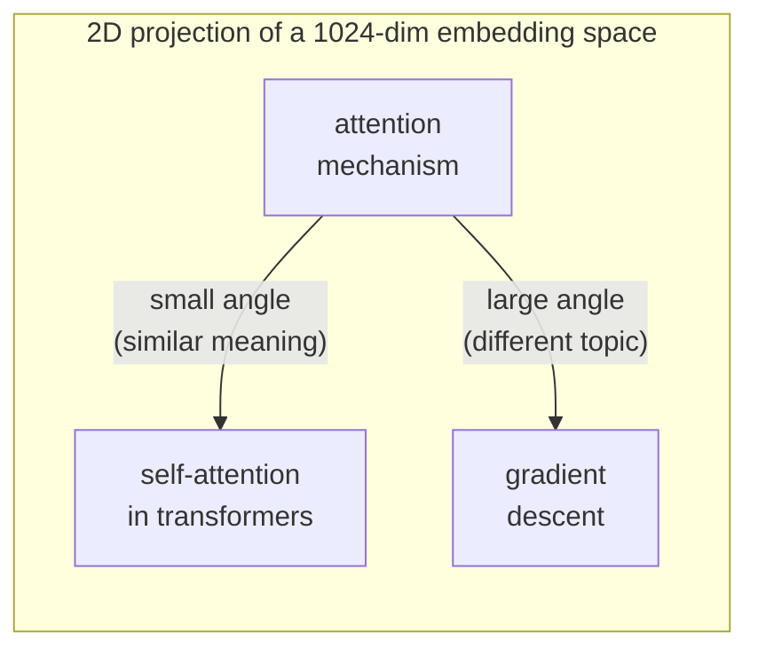

# Embeddings — Text as Vectors

A search engine that can find *conceptually similar* documents — even when they share
no words in common with the query — relies on a deceptively simple idea: turn every
piece of text into a list of numbers, and define "similar meaning" as "similar numbers".

Those lists of numbers are called **embeddings**.

---

## What Is an Embedding?

An embedding model is a neural network trained on massive amounts of text. Its job is
to map any string of text to a fixed-size numerical vector.

```
"attention mechanism"    →  [0.12, -0.43, 0.87, 0.02, ..., -0.11]   # 1024 numbers
"self-attention in LLMs" →  [0.15, -0.39, 0.81, 0.07, ..., -0.08]   # 1024 numbers
"deep learning for NLP"  →  [0.03,  0.71, -0.22, 0.59, ...,  0.44]   # 1024 numbers
```

The first two sentences mean similar things, so the model places them close together
in vector space. The third sentence is on a related but different topic, so its vector
points in a somewhat different direction.

!!! info "Definition — Embedding"
    An *embedding* is a dense, fixed-length vector representation of a piece of text.
    The numbers encode meaning: texts with similar meaning map to nearby vectors.

Think of it like a map. On a geographical map, Paris and Lyon are close together because
they are both French cities. London is further away. Beijing is far across the map.
An embedding space does the same thing for *meaning* instead of geography.

---

## Intuition: Similar Meanings = Similar Directions

The most important property of embeddings is that **semantic similarity corresponds to
geometric proximity**. But "proximity" in high dimensions is measured by *angle*, not
distance. Two vectors that point in nearly the same direction have similar meaning.



In reality these vectors live in 1024 dimensions, not 2, so you cannot visualise them
directly. But the angle intuition holds at any dimensionality.

---

## Cosine Similarity: Measuring the Angle

The standard way to measure similarity between two embedding vectors is **cosine similarity**:
it computes the cosine of the angle between them.

$$
\text{cosine\_similarity}(\mathbf{a}, \mathbf{b}) = \frac{\mathbf{a} \cdot \mathbf{b}}{\|\mathbf{a}\| \cdot \|\mathbf{b}\|}
$$

Where:

- $\mathbf{a} \cdot \mathbf{b}$ is the dot product: $\sum_{i} a_i \cdot b_i$
- $\|\mathbf{a}\|$ is the Euclidean norm (magnitude): $\sqrt{\sum_i a_i^2}$

The result is always between **-1** and **1**:

| Value | Meaning |
|---|---|
| 1.0 | Identical direction — very similar meaning |
| 0.7 | Close — related topics |
| 0.0 | Perpendicular — unrelated |
| -1.0 | Opposite direction — antonyms / contradictions |

!!! example "Worked example (3 dimensions for clarity)"
    ```python
    import numpy as np

    a = np.array([0.6, 0.8, 0.0])   # "attention mechanism"
    b = np.array([0.5, 0.7, 0.1])   # "self-attention in transformers"
    c = np.array([-0.3, 0.1, 0.9])  # "gradient descent"

    def cosine_sim(x, y):
        return np.dot(x, y) / (np.linalg.norm(x) * np.linalg.norm(y))

    print(cosine_sim(a, b))  # 0.997  ← very similar
    print(cosine_sim(a, c))  # 0.065  ← unrelated
    ```

---

## L2 Normalisation: The Shortcut That Matters

Computing cosine similarity requires dividing by both magnitudes — two extra operations
per comparison. When you are searching across 600 papers (tens of thousands of chunks),
this adds up.

There is a cleaner approach: **L2-normalise every vector before storing it**.

L2 normalisation means dividing a vector by its own magnitude so the result has
magnitude exactly 1.0 (a "unit vector"):

$$
\hat{\mathbf{v}} = \frac{\mathbf{v}}{\|\mathbf{v}\|}
$$

After normalisation, the magnitude terms in the cosine formula both equal 1, so:

$$
\text{cosine\_similarity}(\hat{\mathbf{a}}, \hat{\mathbf{b}}) = \hat{\mathbf{a}} \cdot \hat{\mathbf{b}}
$$

**The dot product between two unit vectors *is* the cosine similarity.** No division
required at search time. This is exactly why we use `FAISS IndexFlatIP` (inner product)
rather than `IndexFlatL2` — the inner product over L2-normalised vectors gives us cosine
similarity for free.

Here is the exact normalisation code from `src/ingest.py`:

```python
# src/ingest.py — embed_texts()
embeddings = np.array(all_embeddings, dtype=np.float32)

# L2-normalise: divide each vector by its own Euclidean magnitude.
norms = np.linalg.norm(embeddings, axis=1, keepdims=True)
embeddings = embeddings / np.maximum(norms, 1e-10)
```

The `np.maximum(..., 1e-10)` guard prevents division by zero if a zero vector ever
slips through (degenerate case, but worth handling).

---

## Embedding Dimensions: The Quality–Speed Tradeoff

Our project defines two embedding models:

```python
# src/ingest.py
EMBED_MODEL_PRIMARY = "qwen3-embedding:4b"   # 4096-dim — high quality
EMBED_MODEL_LITE    = "qwen3-embedding:0.6b" # 1024-dim — fast
```

| Property | `qwen3-embedding:0.6b` | `qwen3-embedding:4b` |
|---|---|---|
| Dimensions | 1024 | 4096 |
| Model parameters | ~0.6 billion | ~4 billion |
| FAISS index size (600 docs) | ~10 MB | ~40 MB |
| Embedding speed | ~60 s for 500 docs | ~5 min for 500 docs |
| Retrieval quality | Good | Excellent |
| RAM required | ~1 GB | ~5 GB |

More dimensions means a richer representational space — the model can encode more
nuanced distinctions. But it also means more memory, slower embedding, and slower
search. For a tutorial corpus of 600 papers, 1024 dimensions is the right default.
Swap to the 4b model when you want maximum quality on a production corpus.

!!! tip "Matching models at query time"
    You **must** embed queries with the same model used to build the index.
    Mixing `0.6b` for indexing and `4b` for queries produces vectors from different
    geometric spaces — the dot products become meaningless. `src/ingest.py` enforces
    this by accepting the model name as a parameter that flows through the whole pipeline.

---

## How Ollama Serves Embeddings Locally

Ollama runs LLMs and embedding models as local HTTP servers. The `ollama` Python client
wraps the REST API with a clean interface:

```python
import ollama

response = ollama.embed(model="qwen3-embedding:0.6b", input=["your text here"])
# response["embeddings"] is a list of lists: [[float, float, ...]]
```

Ollama keeps the model loaded in GPU/CPU memory between calls, so repeated calls are
fast. The first call after a system restart includes a model load (~2–5 seconds).

---

## The `embed_query()` Function

At retrieval time, each user question is embedded with a single call. The function is
deliberately separated from `embed_texts()` (the bulk embedder) because queries are
always embedded one at a time and need a specific output shape for FAISS:

```python
# src/ingest.py
def embed_query(query: str, model: str = EMBED_MODEL_LITE) -> np.ndarray:
    """
    Embed a single query string and return a normalised 1D numpy vector.
    Returns float32 array of shape (1, embedding_dim), L2-normalised.
    """
    response = ollama.embed(model=model, input=[query])
    vec = np.array(response["embeddings"][0], dtype=np.float32)
    vec = vec / np.maximum(np.linalg.norm(vec), 1e-10)
    return vec.reshape(1, -1)  # shape (1, 1024) — FAISS expects 2D input
```

The output shape `(1, 1024)` matches what `faiss_index.search()` expects. A subtle
but important detail: FAISS always expects a 2D array even for a single query.

---

## Why qwen3-embedding:0.6b?

The Qwen3 embedding series is Alibaba's open-weight embedding family, released in 2025.
The 0.6b model was chosen for this project for three reasons:

1. **It runs on consumer hardware.** The 0.6b model fits comfortably within 1–2 GB RAM,
   making it accessible on any laptop with 8 GB+ RAM.
2. **Strong multilingual and technical vocabulary.** Qwen3 was trained on a corpus
   heavy with scientific and technical text, which means it understands ML/AI terminology
   well out of the box.
3. **The quality–speed tradeoff is favourable at this scale.** At 600 papers, the 4b
   model produces marginal quality gains over the 0.6b model that are not worth the
   4x embedding time increase.

!!! note "Unverified benchmark caveat"
    The claim that 0.6b vs 4b shows marginal gains at 600 papers is based on
    qualitative testing during project development, not a formal BEIR or MTEB evaluation.
    Part 2 of this tutorial includes a retrieval evaluation framework — you can run
    a formal comparison yourself.

---

## Summary

| Concept | What it means in this project |
|---|---|
| Embedding | Each paper chunk → 1024 float32 numbers |
| Similarity metric | Cosine similarity via dot product |
| Normalisation | All vectors are L2-normalised before storage |
| Index type | FAISS IndexFlatIP (inner product = cosine for unit vectors) |
| Embedding model | qwen3-embedding:0.6b via Ollama |

Now that you understand how text becomes numbers and how those numbers are compared,
the next section explains where those numbers live: the vector database.
