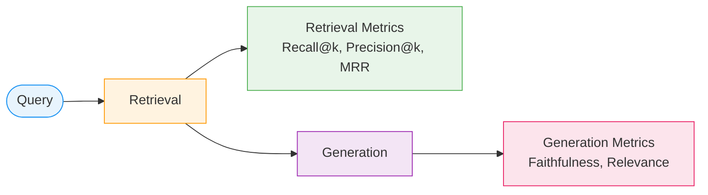

# Evaluation Metrics

Building a better retriever only matters if you can measure whether it is actually
better. This chapter covers the metrics we use, what they mean, and an honest look
at how our numbers changed when we moved from a 5-query to a 20-query evaluation set.

---

## Why Evaluate? Two Failure Modes

A RAG system can fail in two independent ways:

**Retrieval failure**: The right documents are not in the top-k results. No matter how
intelligent the LLM is, it cannot cite evidence it was never given. The answer will
either be vague or fabricated.

**Generation failure**: The right documents *were* retrieved — they appear in the
prompt context — but the LLM ignored them and produced an answer from its training
weights instead. This is hallucination despite correct retrieval.

Evaluating only the final answer conflates both failure modes. You cannot tell whether
a bad answer came from bad retrieval or a bad LLM. We evaluate each stage separately:
retrieval metrics tell us if the right documents were found; generation metrics tell us
if the LLM used them faithfully.

---

## Retrieval Metrics

### Setting Up the Problem

Before computing any metric, we need a ground truth. For each query in the evaluation
set, we have a list of `relevant_ids` — paper IDs that we consider correct answers to
that query. The retriever returns a ranked list of chunks. We project those chunks back
to paper IDs and ask: *how well does the ranked list match the ground truth?*

### Recall@k

!!! info "Definition — Recall@k"
    **Recall@k** measures what fraction of the relevant documents appear anywhere in
    the top-k retrieved results.

$$
\text{Recall@k} = \frac{|\text{relevant} \cap \text{top-k}|}{|\text{relevant}|}
$$

**Worked example**: Suppose the ground truth says papers `[A, B, C]` are relevant.
Your retriever's top-5 results are `[B, D, E, A, F]`.

- Relevant documents found in top-5: `{A, B}` → 2 out of 3
- Recall@5 = 2/3 ≈ **0.667**

Document C was not retrieved — one third of the relevant set was missed.

Recall@k answers: *did we find everything we needed?* It does not care about rank order;
a document at position 5 counts the same as one at position 1.

### Precision@k

!!! info "Definition — Precision@k"
    **Precision@k** measures what fraction of the top-k results are actually relevant.

$$
\text{Precision@k} = \frac{|\text{relevant} \cap \text{top-k}|}{k}
$$

Using the same example: top-5 = `[B, D, E, A, F]`, relevant = `{A, B, C}`.

- Relevant documents in top-5: `{A, B}` → 2 out of 5
- Precision@5 = 2/5 = **0.400**

Three of the five returned documents (`D`, `E`, `F`) were noise.

Precision@k answers: *how much noise did we include?* This matters when the LLM
prompt context is limited — every noise chunk displaces a potentially relevant one.

!!! note "The recall-precision tradeoff"
    Increasing k improves recall (more chances to find relevant docs) but reduces
    precision (more noise in the results). In RAG we typically care more about
    precision because the LLM's context window is the bottleneck. Retrieving 100
    chunks and hoping the LLM ignores the 95 noise ones is not a good strategy.

### Mean Reciprocal Rank (MRR)

!!! info "Definition — MRR"
    **MRR** is the average, across all queries, of the reciprocal of the rank
    at which the first relevant document appears.

$$
\text{MRR} = \frac{1}{|Q|} \sum_{q \in Q} \frac{1}{\text{rank}_q^{\text{first relevant}}}
$$

| First relevant document at rank | Reciprocal rank |
|---------------------------------|-----------------|
| 1 | 1.000 (perfect) |
| 2 | 0.500 |
| 3 | 0.333 |
| 5 | 0.200 |
| Not found | 0.000 |

MRR is the most important metric for RAG. Here is why: when we pass retrieved chunks
to the LLM, we typically pass the top-3 or top-5. If the single best document for a
query is buried at rank 8, the LLM never sees it.

Recall@5 would tell you that document was "close" — it just missed the cut.
MRR would tell you the retriever failed on that query (rank 8 means MRR contribution
of 1/8 = 0.125, compared to a perfect 1.0 if it were ranked first).

MRR is therefore the primary metric we optimise in this project.

---

## Generation Metrics

### Faithfulness (LLM-as-Judge)

Faithfulness answers: *is the generated answer supported by the retrieved context?*

We ask a second LLM (we use `granite4.1:8b` as both generator and judge) to evaluate
each answer. The judge is given the retrieved passages and the generated answer, and
must determine whether every claim in the answer can be traced back to the passages.

```python title="src/evaluator.py — score_faithfulness()"
prompt = """You are a strict factual evaluator. Read the context passages and the answer.
Determine if the answer is FULLY supported by the context — no claims go beyond
what the context states.

Context:
{context_text}

Answer: {answer}

Respond with JSON only: {"faithful": true or false, "reason": "one sentence"}"""
```

The function returns `1.0` for faithful, `0.0` for not. In our 20-query CRAG
evaluation, **7 out of 10 answers were judged faithful** — a 70% faithfulness rate.

!!! warning "Limitations of LLM-as-judge"
    LLM judges can be inconsistent: the same (answer, context) pair may get different
    scores on different runs. They can also be sycophantic — rating confidently-written
    answers as faithful even when the underlying claim is not in the context.
    Treat faithfulness scores as directional signals, not exact measurements.
    For rigorous evaluation, human annotation on a sample is the gold standard.

---

## The Eval Set Problem: 5 Queries vs 20 Queries

Early in this project, we evaluated with only **5 queries**. The numbers looked
encouraging:

| Metric | 5-query eval |
|--------|-------------|
| Dense MRR | 0.600 |
| BM25 MRR | 0.800 |
| Hybrid+Rerank MRR | 0.800 |

These numbers are almost certainly inflated. With 5 queries, each query has a 20%
impact on the average. A single lucky query — one where the relevant paper happened to
land at rank 1 — can swing MRR by 0.2. The variance is enormous and the numbers are
not reliable.

We expanded the evaluation set to **20 queries** and the picture changed:

| Retriever | 5-query MRR | 20-query MRR |
|-----------|-------------|-------------|
| Dense | 0.600 | **0.299** |
| BM25 | 0.800 | **0.441** |
| Hybrid | — | **0.330** |
| Hybrid+Rerank | 0.800 | **0.363** |

Every metric dropped — not because the system got worse, but because the evaluation
set got more honest. Twenty queries still is not a large evaluation set by research
standards (papers typically report on hundreds to thousands of queries), but it is
substantially more representative than five.

!!! tip "Lesson: small eval sets lie"
    If your evaluation set is small enough that one query can move your headline metric
    by 10–20%, your numbers are not trustworthy. Before celebrating an improvement,
    check how many queries are behind the number. The correct reaction to a 0.2 MRR
    improvement on a 5-query eval set is curiosity, not celebration.

---

## The Ground Truth Definition

Our ground truth uses **multi-keyword OR matching**: a paper is considered relevant
to a query if its title or abstract contains at least one of the query's keywords.

This is a practical, automated approach — it scales to 600 papers without human
annotation. But it has limitations:

- A paper can be highly relevant without containing any query keyword (paraphrase problem)
- A paper can contain the keyword without being truly relevant (polysemy problem)
- The definition rewards keyword-based retrieval (which is why BM25 scores well)

This is the honest tradeoff. We note in the results where this measurement choice
affects the interpretation.

---

## Putting It Together

The metrics cascade from retrieval to generation:



Good MRR means the right evidence reached the LLM. Good faithfulness means the LLM
used that evidence rather than hallucinating. Only when both are high is the system
actually working.

The next section covers how the system decides *what to do* when retrieval quality is
low — the agentic loop that makes Part 3 different from Parts 1 and 2.
