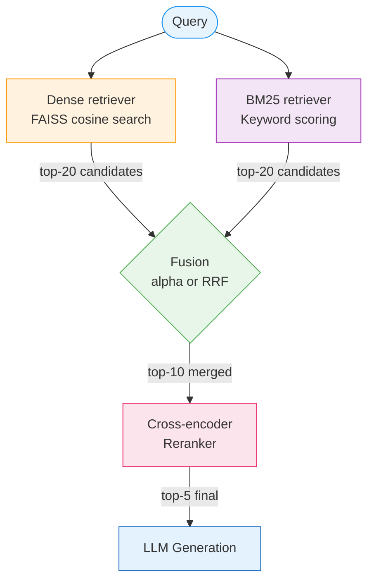

# Hybrid Search

Single retrievers have blind spots. This chapter explains why, and how combining two
complementary strategies — dense embeddings and keyword matching — covers most of them.

---

## The Problem with Going Solo

Imagine you ask: *"What does the attention mechanism do in transformers?"*

A **dense retriever** (embedding-based) handles this beautifully. It does not look for
the exact word "attention" — it understands the semantic neighbourhood of "attention
mechanism" and retrieves chunks that discuss concepts like "query-key-value",
"softmax weighting", and "self-attention", even if those chunks never use the phrase
you typed.

Now imagine you ask: *"Does GPT-4o-mini support structured outputs?"*

The dense retriever struggles here. "GPT-4o-mini" is a specific product identifier.
Embedding models collapse rare tokens into fuzzy semantic regions — "GPT-4o-mini" and
"GPT-4o" are likely to land in nearly the same embedding neighbourhood, and chunks
about the right model may not rank first.

A **BM25 keyword retriever** shines here. It counts exact term occurrences. If a chunk
contains "GPT-4o-mini" three times, it gets a high score for that query regardless of
semantic similarity.

The observation is simple: **the two retrievers fail on complementary queries**.
Combining them is consistently better than either alone. This is hybrid search.

!!! info "Definition — Hybrid Retrieval"
    Hybrid retrieval runs two or more retrieval strategies independently, then
    **fuses** their result lists into a single ranked output. The fusion step is
    where the design decisions live.

---

## Two Ways to Fuse

Once you have two ranked lists, you need to merge them. Two approaches are common.

### Alpha-Weighted Score Fusion

The intuitive approach: treat both scores as numbers and average them, with a
weight `alpha` controlling how much you trust each retriever.

The catch is that **scores live on different scales**. A BM25 score of 14.3 and a
cosine similarity of 0.87 are not comparable. A document that scores 14.3 in BM25 and
0.87 in dense search is not automatically the best — you cannot add apples and oranges.

The fix is **min-max normalisation**: squeeze each retriever's score range to [0, 1]
before blending.

```
dense_norm  = (dense_score  - dense_min)  / (dense_max  - dense_min)
bm25_norm   = (bm25_score   - bm25_min)   / (bm25_max   - bm25_min)

hybrid_score = alpha * dense_norm + (1 - alpha) * bm25_norm
```

With `alpha=0.7` (this project's default), the blend is 70% semantic, 30% keyword.

```python title="src/retriever.py — HybridRetriever._alpha_fusion()"
def _alpha_fusion(self, dense_results, bm25_results, k):
    """Min-max normalise both score sets, then blend with alpha."""
    dense_map = {r["chunk_id"]: r["score"] for r in dense_results}
    bm25_map  = {r["chunk_id"]: r["score"] for r in bm25_results}

    all_ids = set(dense_map) | set(bm25_map)

    d_vals = list(dense_map.values())
    d_min, d_max = (min(d_vals), max(d_vals)) if d_vals else (0, 1)

    b_vals = list(bm25_map.values())
    b_min, b_max = (min(b_vals), max(b_vals)) if b_vals else (0, 1)

    def norm_dense(s):
        return (s - d_min) / max(d_max - d_min, 1e-10)

    def norm_bm25(s):
        return (s - b_min) / max(b_max - b_min, 1e-10)

    fused = []
    for cid in all_ids:
        chunk = dict(all_chunks[cid])
        d_score = norm_dense(dense_map.get(cid, d_min))
        b_score = norm_bm25(bm25_map.get(cid, b_min))
        chunk["score"] = self.alpha * d_score + (1 - self.alpha) * b_score
        chunk["retriever"] = "hybrid"
        fused.append((chunk["score"], chunk))

    fused.sort(key=lambda x: x[0], reverse=True)
    return [c for _, c in fused[:k]]
```

!!! warning "Score normalisation is query-dependent"
    The min and max are computed from *this query's* result set, not the corpus.
    A document that appears only in the dense results gets a BM25 score of `bm25_min`
    (which normalises to 0.0). This is intentional — a document the keyword retriever
    has never heard of should not get a free BM25 bonus.

---

### Reciprocal Rank Fusion (RRF)

Score fusion has a subtle problem: it is sensitive to the *distribution* of scores,
which changes with every query. On one query, dense scores might be tightly clustered
between 0.80 and 0.95; on another, they might span 0.10 to 0.90. Normalising
fixes the scale but not this distributional instability.

RRF sidesteps the problem entirely: **throw away the scores and only keep the ranks**.

The formula for a document `d` appearing across `n` retriever lists is:

$$
\text{RRF}(d) = \sum_{i=1}^{n} \frac{1}{k + \text{rank}_i(d)}
$$

where `k=60` is a smoothing constant (60 is a widely-used empirical default) and
`rank_i(d)` is the position of document `d` in retriever `i`'s list (1-indexed).

!!! note "Why k=60?"
    The constant `k` prevents rank-1 documents from dominating too strongly.
    Without it, `1/rank` at rank 1 equals 1.0 — ten times more than rank 10's 0.1.
    With `k=60`, rank 1 gives `1/61 ≈ 0.0164` and rank 10 gives `1/70 ≈ 0.0143`.
    The difference is still there, but it is gentler.

#### Worked Example

Suppose both retrievers return the same three documents but in different orders:

| Document | Dense rank | BM25 rank |
|----------|-----------|-----------|
| Doc A    | 1         | 3         |
| Doc B    | 2         | 1         |
| Doc C    | 3         | 2         |

RRF scores (with k=60):

| Document | Dense contribution  | BM25 contribution   | Total RRF score |
|----------|--------------------|--------------------|-----------------|
| Doc A    | 1/(60+1) = 0.01639 | 1/(60+3) = 0.01587 | **0.03226**     |
| Doc B    | 1/(60+2) = 0.01613 | 1/(60+1) = 0.01639 | **0.03252**     |
| Doc C    | 1/(60+3) = 0.01587 | 1/(60+2) = 0.01613 | **0.03200**     |

Doc B wins because it was ranked first by at least one retriever and ranked consistently
well by both. Doc A fell to last despite being ranked first by dense search, because BM25
ranked it poorly.

```python title="src/retriever.py — HybridRetriever._rrf_fusion()"
def _rrf_fusion(self, dense_results, bm25_results, k):
    """Reciprocal Rank Fusion — rank-based, ignores raw scores."""
    scores: dict[str, float] = {}
    all_chunks: dict[str, dict] = {}

    for results in [dense_results, bm25_results]:
        for rank, chunk in enumerate(results):
            cid = chunk["chunk_id"]
            scores[cid] = scores.get(cid, 0.0) + 1.0 / (self.rrf_k + rank + 1)
            all_chunks[cid] = chunk

    ranked = sorted(scores.items(), key=lambda x: x[1], reverse=True)[:k]
    result = []
    for cid, score in ranked:
        chunk = dict(all_chunks[cid])
        chunk["score"] = score
        chunk["retriever"] = "hybrid-rrf"
        result.append(chunk)
    return result
```

---

## Alpha vs RRF — When Does Each Win?

| Situation | Prefer alpha fusion | Prefer RRF |
|-----------|--------------------|----|
| Score distributions are stable | Yes | Either |
| Score distributions vary wildly query-to-query | No | Yes |
| You want to tune the dense/keyword balance | Yes (adjust `alpha`) | No (treats both equally) |
| You care about simplicity | Either | Yes (no tuning needed) |
| Your retrievers use incomparable score ranges | Requires care | Yes |

!!! info "What we found in this project"
    On our 20-query, 600-paper evaluation set, **alpha fusion (MRR 0.363) marginally
    outperformed RRF** when both were followed by cross-encoder reranking. The gap was
    small enough that RRF is a reasonable default — it requires no hyperparameter tuning
    and is robust out of the box. Alpha fusion wins here likely because `alpha=0.7`
    correctly weights the relatively stronger dense retriever on ML/AI research queries.

---

## The Full Retrieval Pipeline

With hybrid search in place, the retrieval stage looks like this:



The next section covers the cross-encoder reranker — the step that converts a
good top-10 into a precise top-5.
