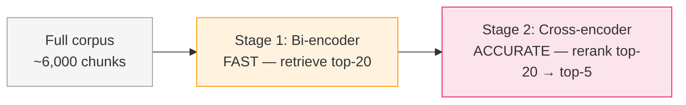

# Reranking

Hybrid search gives you a good shortlist. A cross-encoder reranker turns that shortlist
into a precise, ordered set. This chapter explains why a second retrieval stage is needed
and how it works.

---

## The Bi-Encoder Limitation

Every retriever we have built so far — dense, BM25, hybrid — shares a structural
constraint: **query and document are evaluated independently**.

A bi-encoder (the embedding model behind dense search) works like this:

```
query    → encoder → q_vec ─┐
                              ├── cosine_similarity → score
document → encoder → d_vec ─┘
```

Each text is embedded separately. The score is computed as a single number from two
vectors. The encoder that processes the query has never "seen" the document, and vice
versa. There is no opportunity for the model to notice that a specific phrase in the
query exactly matches a specific phrase in the document, or that the document uses a
synonym the query relies on.

This is not a design flaw — it is a deliberate trade-off. Because embeddings are
pre-computed for every document in the corpus, searching a million documents takes
milliseconds (one dot-product per document, done in batch by FAISS). The bi-encoder
is fast *because* it is independent.

But independence has a cost: **the model misses fine-grained query-document interactions**.

---

## The Cross-Encoder: Joint Encoding

A cross-encoder processes query and document *together* in a single forward pass:

```
[query] [SEP] [document] → encoder → full attention → relevance score
```

Every token in the query can attend to every token in the document. The model can
detect:

- Exact phrase matches (`"chain-of-thought"` in both query and doc)
- Paraphrase at the token level (`"accuracy"` in query, `"performance"` in doc)
- Negations and qualifiers (`"does not improve"` is different from `"improves"`)
- Positional importance (the abstract's first sentence matters more than a footnote)

The result is a much more accurate relevance score — but at a price.

---

## The Cost: Why You Cannot Use a Cross-Encoder Directly

Cross-encoding is O(n) per query: you must run one forward pass for every candidate
document. On a corpus of 600 papers split into roughly 6,000 chunks, that means 6,000
model forward passes per user query. A single forward pass takes ~20ms on CPU. The
math is brutal:

```
6,000 chunks × 20ms = 120 seconds per query
```

That is two minutes of latency for every question. A bi-encoder over the same corpus
takes under a second.

The standard solution is **two-stage retrieval**:



Stage 1 is cheap enough to run over the full corpus. Stage 2 runs on 20 candidates —
20 forward passes instead of 6,000.

!!! tip "Stage 1 quality matters"
    The cross-encoder can only pick winners from what Stage 1 gave it. If the right
    document was not in the top-20, no amount of reranking can surface it. This is why
    we fetch 20 candidates (2× the final output size) in Stage 1, giving Stage 2 room
    to work.

---

## The MS-MARCO Model

This project uses `cross-encoder/ms-marco-MiniLM-L-6-v2`.

- **MS-MARCO**: Microsoft Machine Reading Comprehension, a dataset of ~530,000 real
  Bing search queries paired with relevant passages. The model was trained to distinguish
  relevant from irrelevant passages for those queries.
- **MiniLM-L-6-v2**: a distilled, 6-layer transformer — fast enough for CPU inference.
  The model weights are 22 MB on disk.
- **Zero-shot on ArXiv**: MS-MARCO queries are general web searches, not academic
  research queries. The model was never trained on "what does attention do in a
  transformer" style questions — yet it generalises well, because the
  relevance signal (does this passage answer this question?) transfers across domains.

!!! info "What the score means"
    The cross-encoder outputs a raw logit — an unbounded float. A higher logit means
    "more relevant." The absolute value has no meaning; only the relative ordering
    matters for reranking. You should not interpret a score of 8.2 as "82% relevant."

---

## The Code

```python title="src/retriever.py — Reranker.rerank()"
class Reranker:
    def __init__(
        self,
        model_name: str = "cross-encoder/ms-marco-MiniLM-L-6-v2",
    ) -> None:
        self.model = CrossEncoder(model_name)

    def rerank(
        self,
        query: str,
        candidates: list[dict],
        top_k: int = 5,
    ) -> list[dict]:
        if not candidates:
            return []

        # Build (query, passage) pairs for the cross-encoder
        pairs = [(query, c["text"]) for c in candidates]
        scores = self.model.predict(pairs)  # one forward pass per pair

        # Zip scores back to chunks and sort descending
        scored = sorted(
            zip(scores, candidates),
            key=lambda x: x[0],
            reverse=True,
        )

        results = []
        for score, chunk in scored[:top_k]:
            chunk = dict(chunk)
            chunk["score"] = float(score)
            chunk["retriever"] = "reranked"
            results.append(chunk)

        return results
```

Key design choices:

1. **Batch prediction**: `self.model.predict(pairs)` sends all 20 pairs in one call.
   The `CrossEncoder` handles batching internally — this is more efficient than calling
   predict 20 times in a loop.

2. **Score overwrite**: The `"score"` key is replaced with the cross-encoder logit,
   discarding the hybrid fusion score. The cross-encoder's ordering is the one we trust.

3. **Retriever tag**: `"retriever": "reranked"` lets downstream code (and the evaluator)
   know which stage produced the final results.

---

## Real Impact

On our evaluation set (20 queries, 600-paper corpus):

| Retriever | MRR |
|-----------|-----|
| Dense only | 0.299 |
| BM25 only | 0.441 |
| Hybrid (alpha) | 0.330 |
| **Hybrid + Rerank** | **0.363** |

Reranking added **+0.033 MRR** over hybrid alone — a meaningful improvement that
reflects the cross-encoder finding better orderings within each candidate set.

!!! note "Why did BM25 alone beat hybrid in this eval?"
    Our 20-query evaluation set uses multi-keyword OR matching to define ground truth
    (a paper is relevant if it contains at least one query keyword). This definition
    naturally rewards keyword-based retrieval. BM25's strong showing here is partly
    a measurement artefact; on semantic or paraphrase queries, dense and hybrid
    methods tend to outperform BM25 on human-judged relevance.

The next section covers how we measure these numbers systematically — the evaluation
metrics that power every result table in this tutorial.
