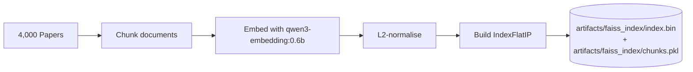
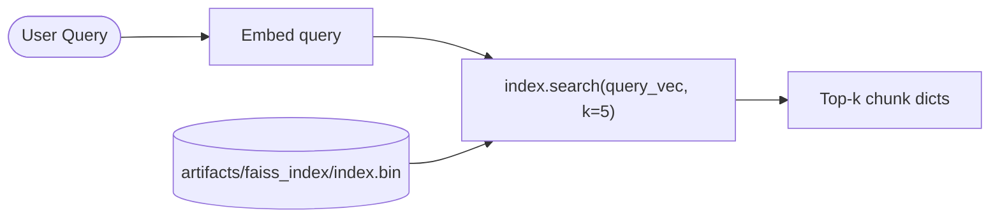

# Vector Databases

You have an ArXiv corpus (current baseline 4,000 papers; legacy baseline 600), each converted to one or more embedding vectors of 1024
numbers. When a user asks a question, you embed the question and want to find the
5 vectors in that collection that are most similar to the question's vector. How do
you store those vectors so that query is fast?

A regular database will not help you here.

---

## Why Regular Databases Cannot Do This

SQL databases are excellent at exact lookups:

```sql
SELECT * FROM papers WHERE category = 'cs.AI' AND year = 2024;
```

They can also do range queries, joins, and aggregations. What they cannot do
efficiently is: **"find me the 5 rows whose `embedding` column is closest in cosine
similarity to this query vector."**

There is no SQL index structure designed for that question. You would have to load
every row, compute cosine similarity against the query, and sort — a full table scan
for every single query. At 4,000 papers that takes milliseconds. At 6 million papers
it takes tens of seconds per query.

!!! info "Definition — Nearest Neighbour Search"
    Given a query vector **q** and a collection of stored vectors {**v₁**, **v₂**, ..., **vₙ**},
    find the k vectors with the highest cosine similarity to **q**.
    This problem is called *k-Nearest Neighbour (k-NN) search*.

Vector databases are purpose-built for k-NN search. They use specialised index
structures — exact or approximate — that make this query fast even at millions of
vectors.

---

## FAISS — The Index We Use in This Project

FAISS (Facebook AI Similarity Search) is an open-source C++ library with Python
bindings, developed by Meta's AI Research team. It is not a "database" in the
traditional sense — there is no server process, no authentication, no SQL. It is
a library: you build an index in-process, add vectors to it, and search it.

Think of FAISS as a very smart filing system. You hand it a stack of index cards
(vectors), it sorts and organises them, and when you ask "which 5 cards are most
similar to this new card?", it tells you instantly.

### IndexFlatIP — Exact Brute-Force Search

The index type used in this project is `IndexFlatIP`:

- **Flat** means the index stores every vector verbatim — no compression, no
  approximation.
- **IP** means it scores vectors by Inner Product (dot product).
- Because our vectors are L2-normalised, inner product equals cosine similarity
  (see the [Embeddings](embeddings.md) section).

```python
# src/ingest.py — build_faiss_index()
import faiss

def build_faiss_index(embeddings: np.ndarray) -> faiss.IndexFlatIP:
    n, dim = embeddings.shape          # e.g. (1200, 1024)
    index = faiss.IndexFlatIP(dim)     # create a 1024-dim inner-product index
    index.add(embeddings)              # add all vectors at once
    return index
```

Searching is one line:

```python
scores, indices = index.search(query_vec, k=5)
# scores:  float32 array of shape (1, k) — cosine similarities
# indices: int64  array of shape (1, k) — position of each result in the corpus
```

### Exact vs Approximate Search

`IndexFlatIP` performs **exact** search — it computes the dot product against every
stored vector and returns the true top-k. This is always correct, but it is O(n·d)
per query (n vectors, d dimensions).

| Corpus size | IndexFlatIP query time | Verdict |
|---|---|---|
| 10K vectors | < 1 ms | Fine |
| 1M vectors | ~500 ms | Borderline |
| 100M vectors | ~50 s | Unacceptable |

For large corpora, FAISS provides approximate indices that trade a small accuracy
loss for dramatic speed gains:

- **IndexIVFFlat** — divides the space into "cells"; searches only nearby cells.
- **IndexHNSW** — hierarchical graph structure; sub-millisecond queries at millions of vectors.
- **IndexPQ** — product quantisation; compresses vectors to reduce memory.

For this project's tutorial-scale corpora, `IndexFlatIP` is exactly right.
The corpus fits in memory, queries take microseconds, and there is zero accuracy loss.

!!! tip "When to switch to approximate search"
    If your corpus grows beyond ~500K vectors and query latency exceeds 100 ms, switch
    to `IndexIVFFlat` (good first step) or `IndexHNSW` (best latency). FAISS makes
    this a one-line change — same API, different index class.

---

## ChromaDB — Persistent, Filterable, Local or Server

ChromaDB is a purpose-built open-source vector database. Unlike FAISS, it is a full
database: it persists to disk automatically, survives process restarts, stores metadata
alongside vectors, and supports metadata filters at query time.

```python
import chromadb

client = chromadb.PersistentClient(path="./chroma_db")
collection = client.get_or_create_collection("arxiv_papers")

# Upsert documents (ChromaDB embeds them or accepts pre-computed vectors)
collection.upsert(
    ids=["paper_001", "paper_002"],
    documents=["abstract text 1", "abstract text 2"],
    metadatas=[{"category": "cs.AI"}, {"category": "cs.LG"}],
)

# Semantic search with a metadata filter
results = collection.query(
    query_texts=["chain of thought reasoning"],
    n_results=5,
    where={"category": "cs.AI"},   # metadata filter
)
```

The metadata filter (`where`) is a feature FAISS does not have — with FAISS you
retrieve by vector similarity alone and then filter the results in Python. ChromaDB
pushes the filter into the index, which is more efficient when you only want results
from a specific category, date range, or author.

ChromaDB also runs as a standalone server, making it accessible from multiple processes
or services — a step toward a deployed application.

!!! note "ChromaDB in this project"
    ChromaDB is introduced in **Part 4** of this tutorial (vector store swap-out).
    We cover it here so you understand the landscape before you need to choose.

---

## Pinecone — Cloud-Native, Serverless, Production Scale

Pinecone is a managed cloud vector database. You do not install anything — you create
an index via the Pinecone console or API, push vectors to it, and query it from
anywhere over HTTP.

```python
from pinecone import Pinecone

pc = Pinecone(api_key="your-api-key")
index = pc.Index("arxiv-papers")

# Upsert vectors
index.upsert(vectors=[
    {"id": "paper_001", "values": embedding_list, "metadata": {"category": "cs.AI"}},
])

# Query
results = index.query(vector=query_embedding, top_k=5, include_metadata=True)
```

Pinecone handles sharding, replication, and hardware scaling automatically. The
"serverless" tier scales to zero when idle, making it cost-effective for low-traffic
applications. The managed tier provides dedicated resources for consistent latency.

The tradeoff: Pinecone is a paid service (with a free tier), your vectors leave your
machine, and you depend on their API availability.

!!! note "Pinecone in this project"
    Pinecone integration is also covered in **Part 4**. The MCP Pinecone server
    (`mcp__pinecone`) is available in this environment for experimenting with
    the Pinecone API directly.

---

## Comparison: FAISS vs ChromaDB vs Pinecone

| Feature | FAISS | ChromaDB | Pinecone |
|---|---|---|---|
| Type | Library (in-process) | Embedded / Server DB | Managed cloud service |
| Persistence | Manual (save/load files) | Automatic | Automatic (cloud) |
| Metadata filters | No (post-filter in Python) | Yes | Yes |
| Setup complexity | Low | Low | Low (API key) |
| Data leaves machine | No | No | Yes |
| Cost | Free | Free | Free tier / paid |
| Max scale | ~10M vectors (exact) | ~1M vectors (local) | Billions (managed) |
| Best for | Research, prototypes, offline | Apps needing persistence and filtering | Production, multi-region, large scale |
| Used in this project | Parts 1–3 | Part 4 | Part 4 |

---

## How FAISS Is Used in This Project

The full lifecycle of the FAISS index spans two phases:

**Build time** (notebook `01_naive_rag.ipynb`, run once):



**Query time** (core retrieval notebooks):



The `save_index_and_chunks()` and `load_index_and_chunks()` functions in
`src/ingest.py` handle the persistence. The index and the chunk metadata list are
always saved together — the integer positions FAISS returns are only meaningful
if you have the matching `artifacts/faiss_index/chunks.pkl` to look up.

---

## Summary

| System | Role in this project |
|---|---|
| FAISS IndexFlatIP | Exact cosine similarity search over L2-normalised vectors |
| ChromaDB | Persistent alternative with metadata filtering (Part 4) |
| Pinecone | Cloud-native alternative for production scale (Part 4) |

Now that you know how vectors are stored and searched, the next section covers the
other half of the retrieval story: keyword-based search with BM25.
