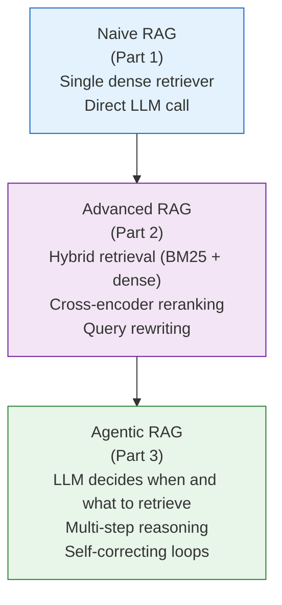

# What Is RAG?

Before we write a single line of retrieval code, we need to understand *why* RAG exists.
The answer starts with two uncomfortable truths about large language models.

---

## The Two Problems RAG Solves

### Problem 1 — LLMs Hallucinate

Ask a language model a question it does not know the answer to and it will not say
"I don't know." It will invent a plausible-sounding answer, cite papers that do not
exist, and deliver the whole thing with complete confidence.

This is not a bug to be fixed in the next version. It is a structural property of how
these models work. An LLM learns to predict the next token given everything that came
before. When no correct token is strongly favoured by training, the model still has to
output *something* — and it picks whatever is statistically plausible in that context.
The model has no internal alarm that fires when it is making something up.

!!! note "Why the confident tone?"
    Training data contains authoritative text — textbooks, Wikipedia, academic papers.
    The model learns that confident, declarative sentences are common in these sources.
    So when it generates freely, it naturally produces confident-sounding text, even
    when the content is fabricated.

### Problem 2 — LLMs Have a Knowledge Cutoff

Every LLM is trained on a snapshot of the internet up to a certain date. GPT-4's
training data ends in early 2024. Claude's ends in early 2025. Any paper published
after that date simply does not exist as far as the model is concerned. Ask it about
a technique introduced last month and it either admits ignorance or — worse —
confabulates an answer based on adjacent knowledge.

For a research assistant over 600 ArXiv ML papers (many of which are recent), this
is fatal. The entire value of the tool is access to *current* work.

---

## The RAG Solution: Retrieve First, Then Generate

Retrieval-Augmented Generation (RAG) fixes both problems with a simple but powerful
idea: **give the model the relevant documents at query time, inside the prompt**.

Think of it like the difference between two kinds of exams:

- **Closed-book exam**: the student relies entirely on memorised knowledge.
  An LLM answering from parameters alone is a closed-book exam.
- **Open-book exam**: the student can consult their notes during the exam.
  RAG gives the LLM its "notes" — the retrieved documents — before it answers.

The model cannot hallucinate facts from a document it can read directly. And the
documents can be updated at any time without retraining the model.

### The Core Loop

1. **Retrieve** — the user's question is converted to a search query. The retriever
   finds the most relevant chunks from the knowledge base (our 600 ArXiv papers).
2. **Prompt** — those chunks are inserted into a prompt template alongside the
   original question. The LLM now has the evidence it needs.
3. **Generate** — the LLM reads the evidence and writes an answer grounded in it.

!!! example "Concrete example"
    **User asks:** "What are the key contributions of the paper on chain-of-thought prompting?"

    **Without RAG:** The LLM might describe CoT correctly in broad strokes but invent
    specific results or misattribute the paper.

    **With RAG:** The retriever finds the actual CoT paper's abstract in the index.
    The LLM reads the abstract in the prompt and summarises what it actually says.

---

## RAG vs Fine-Tuning

A common question: if you want the model to know about new information, why not just
fine-tune it on that information?

| Concern | Fine-tuning | RAG |
|---|---|---|
| Adding new documents | Retrain (hours–days) | Reindex (minutes) |
| Knowledge provenance | Opaque (baked into weights) | Transparent (source chunks visible) |
| Hallucination risk | Still present | Reduced (evidence in-context) |
| Cost | High (GPU compute) | Low (embedding + vector search) |
| Best for | Teaching *style* and *behaviour* | Teaching *factual knowledge* |

!!! tip "Rule of thumb"
    Fine-tune when you want the model to behave differently.
    Use RAG when you want the model to know different things.

    They are not mutually exclusive — you can fine-tune a model to follow a specific
    answer format and then deploy it with RAG to supply current knowledge.

---

## Three Levels of RAG

This tutorial is structured around three progressively more capable RAG architectures.
Think of them as a staircase.

**Naive RAG** is the baseline: embed the query, find the top-5 chunks, paste them into
a prompt, call the LLM. Simple, fast, and surprisingly effective. We build this in Part 1.

**Advanced RAG** layers on improvements: better retrieval (hybrid dense + BM25 search),
a re-ranker to filter noise, and query rewriting to handle vague questions. Part 2 shows
how each improvement moves the evaluation metrics.

**Agentic RAG** is where the LLM becomes a *reasoning agent*. Instead of a fixed
retrieve → generate pipeline, the agent decides whether it needs to retrieve, what query
to issue, whether the results are sufficient, and whether to loop again. This is the
architecture that handles multi-hop questions and complex research tasks. Part 3.

!!! info "Definition — Agentic AI"
    An *agent* is an LLM that can take actions in a loop: observe → think → act →
    observe. In agentic RAG, the LLM's "act" step includes issuing retrieval queries,
    and it loops until it has enough evidence to answer confidently.

---

## What This Project Builds

Across all three notebooks you will build a complete RAG pipeline over 600 ArXiv ML/AI
papers:

- Embeddings via **qwen3-embedding:0.6b** running locally through Ollama (1024 dimensions)
- A **FAISS** index for fast semantic search
- A **BM25** keyword index for exact-term matching
- Answer generation via **granite4.1:8b** (also local, also through Ollama)

By the end of Part 3, you will have a system that can answer research questions like
"What methods have been proposed to improve reasoning in LLMs?" by retrieving and
synthesising evidence from multiple papers — without a single API call to a paid service.

The next section explains the technology that makes semantic search possible: embeddings.
