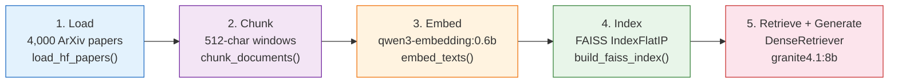

# Part 1 — Naive RAG: Overview

Part 1 builds the simplest possible RAG pipeline: embed a corpus, store the vectors in FAISS,
embed a query, retrieve the top-5 chunks, and hand them to a language model. No reranking,
no keyword search, no self-correction loop. Just the bare bones.

This is intentional. The naive pipeline is fast to build, easy to reason about, and gives us
a measured baseline. Every improvement in Parts 2 and 3 is justified by comparing against
the numbers we record here.

---

## What you build in this part

The pipeline has five stages. Each stage is a function in `src/ingest.py` — one file that all
three notebooks share.

At the end of the notebook you run a 20-query evaluation and record the baseline metrics.

Current 4,000-paper baseline:

| Metric | Value |
|---|---|
| Recall@5 | 0.050 |
| Precision@5 | 0.010 |
| MRR | 0.0167 |

Historical legacy 600 baseline (for comparison): Recall@5 = 0.250, Precision@5 = 0.120, MRR = 0.2992.

These are your baseline. Part 2 improves them with hybrid retrieval and reranking.
Part 3 builds an agent on top.

---

## The notebook file

**`notebooks/01_naive_rag.ipynb`** is the runnable version of this tutorial section.
Each cell corresponds to a stage in the pipeline. The notebook:

1. Calls `load_hf_papers()` to pull 4,000 ML papers from the `ccdv/arxiv-summarization` dataset.
2. Calls `chunk_documents()` to split each abstract into 512-character overlapping chunks.
3. Calls `embed_texts()` to generate 1024-dimensional vectors via Ollama.
4. Calls `build_faiss_index()` to construct the FAISS index in memory.
5. Calls `save_index_and_chunks()` to write the index to `artifacts/faiss_index/`.
6. Instantiates `DenseRetriever` and runs several example queries.
7. Defines a 20-query evaluation set and calls `compute_retrieval_metrics()`.
8. Saves results to `artifacts/eval_results/01_naive_rag_4000.json` for comparison across parts.

!!! info "Definition — Naive RAG"
    "Naive" means a single retrieval pass with a single dense retriever and no post-processing.
    The term is used in the literature to distinguish the baseline from advanced variants that
    add reranking, query rewriting, or hybrid search.

---

## Why start simple?

It is tempting to skip straight to the agentic architecture. Resist that temptation for three
reasons:

1. **Debugging is easier.** With five functions, every failure has an obvious owner.
   If the answers are bad, you can tell in seconds whether the retriever is returning
   the wrong chunks or the LLM is ignoring good ones.

2. **The numbers are honest.** Reporting MRR = 0.441 in Part 2 is only meaningful if you
   also know the Part 1 baseline was 0.299. Without the naive run, the improvement is a number
   with no context.

3. **The shared index.** Notebooks 02 and 03 call `load_index_and_chunks()` and reuse the FAISS
   index you build here. You do the expensive embedding work once.

!!! warning "Run notebook 01 before notebooks 02 and 03"
    Notebooks 02 and 03 call `load_index_and_chunks()` and expect to find
    `artifacts/faiss_index/index.bin` and `artifacts/faiss_index/chunks.pkl`.
    These files are created by notebook 01. If you skip notebook 01 and run
    notebook 02 directly, you will get a `FileNotFoundError`.

---

## What's next

The next page — [Loading Data](loading_data.md) — walks through the `load_hf_papers()` function
in detail: what the HuggingFace dataset contains, why we filter by ML keywords, and what a
paper dict looks like before it enters the chunking step.
