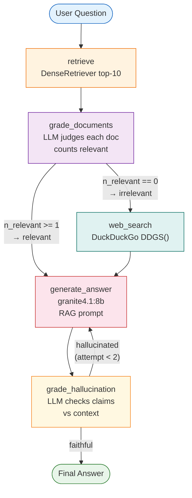

# Part 3 — Agentic RAG: Overview

Parts 1 and 2 built pipelines: a question comes in, fixed steps execute in order, an
answer comes out. There is no feedback, no reconsideration, and no fallback when the
retriever returns weak results. The pipeline cannot tell the difference between a great
answer and a hallucinated one.

Part 3 changes this. Instead of a pipeline, we build a **reasoning loop** — a graph of
nodes where the LLM actively decides what happens next.

---

## What Part 3 adds

Three capabilities that no pipeline can provide:

**Relevance gating.** After retrieval, an LLM judge reads each retrieved document and
decides whether it actually answers the question. If the corpus produces nothing useful,
the agent takes a different path instead of generating a bad answer from bad evidence.

**Web search fallback.** When the local corpus is genuinely insufficient, the agent
queries DuckDuckGo and appends real web results to the context. Corpus gaps do not mean
a dead end.

**Self-correction.** After generating an answer, a second LLM judge checks whether
the answer makes claims not supported by the retrieved context. If the answer
hallucinates, the agent loops back and tries again — up to two times.

---

## The agentic loop concept

Think of the Part 2 pipeline as a single train journey: you board at retrieve, stop at
rerank, and get off at generate. There is only one route.

An agent is more like a sat-nav: it starts at retrieve, checks whether the result is
useful, and then *decides* whether to take the generate route or the web-search
detour. After generating, it checks the answer and either ends the journey or loops
back. The route through the graph is determined at runtime, not at design time.

This is what "agentic" means: the system has agency over its own execution path.

---

## Full graph diagram

Five nodes. Two conditional routing decisions. One state object that flows through all
of them and accumulates the evidence, grades, and trace as it goes.

---

## Results preview: Part 3 vs Part 2

Part 2 measures retrieval quality — how good is the ranked list. Part 3 measures
something different: agent behaviour over full question-answering.

| Metric | Part 2 (pipeline) | Part 3 (agent) |
|---|---|---|
| Relevant docs retrieved | — | 10 / 10 (100%) |
| Web search triggered | — | 0 / 10 (0%) |
| Faithful answers | — | 7 / 10 (70%) |
| Average latency | ~200 ms | ~15 s / query |

The latency increase is real and significant. Every query now involves multiple LLM
calls for grading, not just one for generation. This is the core tradeoff of agentic
RAG: higher quality at higher cost.

!!! info "Why 10 queries, not 20?"
    Each query takes ~15 seconds because of multiple sequential LLM calls.
    20 queries would take ~5 minutes. 10 is a reasonable evaluation budget for a
    tutorial notebook. The tradeoff between coverage and latency is discussed further
    in [Evaluation](evaluation.md).

---

## The CRAG paper

This architecture implements Corrective Retrieval-Augmented Generation (CRAG), proposed
by Yan et al. (2024). The core idea from the paper is that retrieval is not always
correct, and the system should detect and correct retrieval failures before generating.

We implement the spirit of CRAG — retrieval grading, web fallback, faithfulness
checking — with adaptations for our fully local stack. The [CRAG Architecture](crag_architecture.md)
page explains the mapping in detail.

---

## The notebook file

**`notebooks/03_agentic_rag.ipynb`** is the runnable version of this section. It
depends on the FAISS index built in notebook 01. Each cell maps to one node in the
graph, so you can test nodes in isolation before assembling the full agent.

!!! warning "Run notebook 01 first"
    Notebook 03 calls `load_index_and_chunks()` and expects `artifacts/faiss_index/`
    to exist. Build it by running notebook 01 if you have not already.

---

## What's next

[LangGraph Basics](langgraph_basics.md) introduces the framework we use to build the
graph: what a `StateGraph` is, how nodes and edges work, and the key API calls — before
any RAG-specific code appears.
