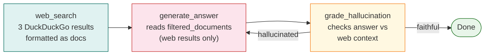

# Web Search Fallback

The `web_search` node fires when `grade_documents` finds zero relevant documents in the
local corpus. Instead of generating a bad answer from bad evidence, the agent queries
the web and appends the results to `filtered_documents` before generation.

---

## When the fallback fires

The conditional edge after `grade_documents` makes a binary choice:

```python
def route_after_grading(state: GraphState) -> str:
    return state["retrieval_grade"]   # "relevant" or "irrelevant"

graph_builder.add_conditional_edges(
    "grade_documents",
    route_after_grading,
    {
        "relevant": "generate_answer",
        "irrelevant": "web_search",
    }
)
```

`retrieval_grade` is `"irrelevant"` only when **zero** documents passed the relevance
check — not one, not a weak one, but zero. With the 2-tier threshold introduced in
Improvement 5, a single relevant document is enough to skip the web search entirely.

In our 10-query evaluation over 600 ArXiv ML/AI papers, `web_search` was triggered
**0 out of 10 times** (0%). This is a good outcome: it means the local corpus was
sufficient for every query in the evaluation set. The web fallback exists as a safety
net for genuine corpus gaps, not as a default behaviour.

---

## The web_search node

```python
from duckduckgo_search import DDGS

def web_search(state: GraphState) -> dict:
    question = state["question"]
    filtered_documents = list(state["filtered_documents"])
    trace = list(state["execution_trace"])

    trace.append(f"web_search: querying DuckDuckGo for '{question}'")

    with DDGS() as ddgs:
        results = list(ddgs.text(question, max_results=3))

    web_docs = []
    for r in results:
        web_docs.append({
            "content": f"{r.get('title', '')}\n\n{r.get('body', '')}",
            "source": r.get("href", "web"),
            "title": r.get("title", ""),
        })

    filtered_documents.extend(web_docs)
    trace.append(
        f"web_search: appended {len(web_docs)} web results to filtered_documents"
    )

    return {
        "filtered_documents": filtered_documents,
        "execution_trace": trace,
    }
```

**Line-by-line walkthrough:**

- `DDGS()` is the DuckDuckGo search client from the `duckduckgo-search` library.
  It requires no API key and no authentication — fully local, no quota.
- `max_results=3` limits the web results to three. This is a deliberate choice: more
  results mean more noise and a longer prompt. Three results cover the most likely
  relevant pages without inflating context size.
- Each result is formatted as a dict with a `"content"` key (title + body), a
  `"source"` key (the URL), and a `"title"` key. This matches the structure of corpus
  documents so the `generate_answer` node does not need to treat web results
  differently from corpus results.
- The results are **appended** to `filtered_documents`, not used to replace them. If
  any corpus documents passed grading (unlikely since we only reach this node when
  `n_relevant == 0`), they are kept. Web results supplement rather than override.

---

## How web results flow to generation

After `web_search` runs, the fixed edge `add_edge("web_search", "generate_answer")`
sends execution to `generate_answer`. That node always reads from
`state["filtered_documents"]`, which now contains the web results:

```python
def generate_answer(state: GraphState) -> dict:
    context = "\n\n".join(
        doc["content"] for doc in state["filtered_documents"]
    )
    # ... build prompt with context and question, call LLM
```

The LLM never knows whether the context came from the local corpus or the web. The
routing logic is entirely outside the generation prompt.

---

## The risk of web noise

The web fallback introduces a risk that the local corpus does not: **uncontrolled
content quality**.

The FAISS index contains 600 curated ArXiv abstracts. DuckDuckGo returns whatever
ranks highest for the query — which could be blog posts, forum threads, or vendor
marketing pages alongside genuine research results. This content may be:

- Partially incorrect or outdated
- Written for a different audience (practitioner blog vs academic paper)
- Missing context that makes it misleading when excerpted

The `grade_hallucination` node mitigates this somewhat: if the generation introduces
claims not supported by the web results, it will be caught and retried. But the judge
is imperfect, and web-sourced answers deserve more scrutiny than corpus-sourced ones.

!!! warning "Web results are not fact-checked"
    The current implementation trusts DuckDuckGo results at face value. For a
    production system, you would want to add a credibility filter (e.g., restrict to
    known academic domains like arxiv.org, semanticscholar.org) before appending web
    results to the context.

---

## What happens after web_search



The faithfulness check applies equally to web-sourced answers. A hallucination over
web results is still a hallucination.

---

## What's next

[Threshold Improvement](threshold_improvement.md) explains the single code change that
reduced web search triggering from 20% to 0% in our evaluation — and why the 3-tier
routing in the original implementation was counterproductive.
