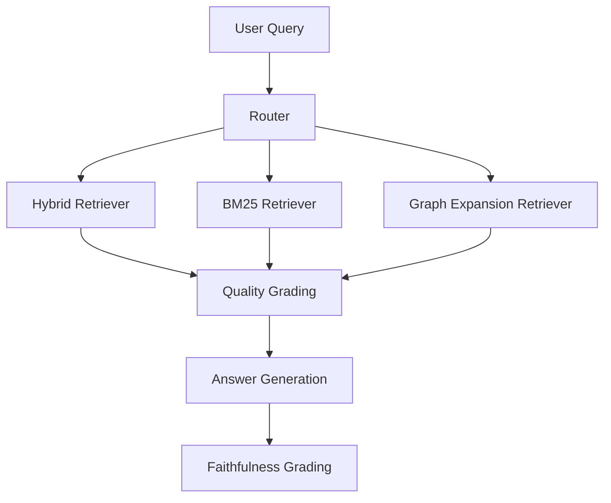

# Agentic RAG

Notebook: `notebooks/07_agentic_rag.ipynb`

Executed notebook: `notebooks/07_agentic_rag.executed.ipynb`

Artifact: `artifacts/rag_v2/agentic/07_agentic_metrics.json`

---

## What Is This Technique?

Agentic RAG introduces decision-making into RAG. Instead of one fixed retrieval path, the system selects retrieval behavior based on query characteristics and intermediate quality signals.

### Definition and Core Concepts

- **Routing policy:** choose retrieval strategy per query.
- **Tool-aware retrieval:** hybrid, BM25, or graph-expanded retrieval paths.
- **Quality-aware execution:** include grading and trace-level observability.

### Why Was It Developed?

Traditional pipeline RAG applies the same path to every query, even when query intent differs (keyword-heavy, synthesis-heavy, conceptual, etc.).

### What Traditional RAG Limitation Does It Solve?

It addresses one-size-fits-all retrieval and adds explicit runtime control of the answering path.

---

## Architecture and Workflow

### Diagram Explanation

- Router selects retrieval route from query features.
- Retrieved context receives quality grading.
- Answer generation and faithfulness checking close the loop with explicit trace metadata.

---

## Component-by-Component Breakdown

1. **Router (`route_query`)**
   - Deterministic route selection from query text patterns.
2. **Retrievers**
   - Hybrid/BM25/Graph-enabled retrieval utilities.
3. **Quality Grading**
   - Lightweight relevance grading in runtime-light mode.
4. **Answer + Faithfulness**
   - Sampled full `granite4.1:8b` generation and judging.

---

## When Should It Be Used?

Use Agentic RAG when:

- query types vary widely
- you need traceable routing decisions
- you need a bridge between static retrieval and full corrective agents

---

## Advantages and Disadvantages

### Advantages

- Adaptive retrieval behavior.
- Better observability than fixed pipelines.
- Easy to extend with additional tools and policies.

### Disadvantages

- More orchestration complexity.
- Tail latency risk from LLM grading/generation stages.
- Requires route-policy monitoring and calibration.

---

## Comparison vs Standard RAG and Other Variants

| Variant | Control Style | Error Handling |
|---|---|---|
| Standard RAG | Static | Minimal |
| Hybrid RAG | Static fusion | Minimal |
| GraphRAG | Static graph expansion | Minimal |
| Agentic RAG | Dynamic routing | Moderate |
| CRAG | Dynamic + corrective loop | Stronger |

Agentic RAG is the step where retrieval becomes decision-driven rather than purely score-driven.

---

## Implementation Details in This Project

- Uses existing retrievers from `src/rag_v2/retrieval.py`.
- Includes graph-assisted route capability via `src/rag_v2/graph.py`.
- Saves route, grading, faithfulness, and latency per query run.
- Uses runtime-light evaluation with sampled full LLM rows for practical end-to-end execution time.

---

## Real Run Results and Analysis

### Run Summary (Real)

| Metric | Value |
|---|---:|
| Route distribution | `{'hybrid': 6}` |
| LLM-evaluated rows | 1 |
| Mean faithfulness (evaluated rows only) | 1.0 |
| Latency P50 (ms) | 167.89 |
| Latency P95 (ms) | 20352.27 |

### Interpretation

1. All six evaluated queries were routed to the hybrid path by current deterministic router rules.
2. Median latency is retrieval-dominant and low, while P95 is dominated by sampled full LLM flow.
3. Faithfulness score is high for the sampled row because the answer explicitly acknowledged missing context.

### Why These Outputs Happened

- The current query set did not trigger BM25- or graph-route keywords in router logic.
- Tail latency arises from `granite4.1:8b` generation/judging calls, not retrieval.
- The judged answer was graded faithful because it abstained instead of hallucinating unsupported content.

---

## Lessons Learned and Practical Takeaways

1. Routing observability is immediately useful, even before complex policies.
2. Tail latency management is mandatory in agentic flows.
3. Route-policy coverage tests are needed to ensure all route branches are exercised.

---

## Final Conclusion

Agentic RAG is fully implemented and executable with real outputs. The run confirms robust orchestration scaffolding and traceability, while highlighting two practical next steps for production: broader route-policy coverage and stronger latency controls on LLM-heavy branches.
