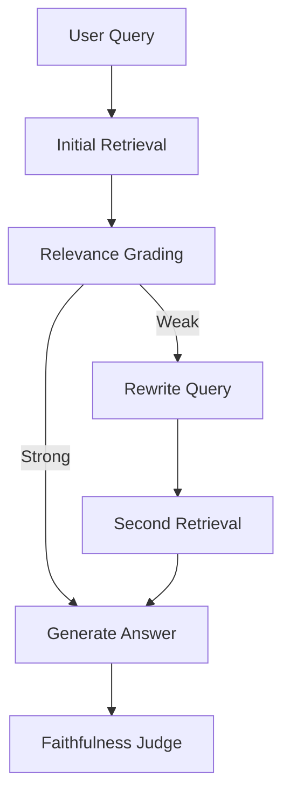

# Corrective RAG (CRAG)

Notebook: `notebooks/08_crag.ipynb`

Executed notebook: `notebooks/08_crag.executed.ipynb`

Artifact: `artifacts/rag_v2/crag/08_crag_metrics.json`

---

## What Is This Technique?

CRAG adds a correction loop to RAG:

1. retrieve context
2. grade retrieval quality
3. if weak, rewrite query and re-retrieve
4. generate answer
5. grade faithfulness

### Definition and Core Concepts

- **Corrective control loop** before final answer commitment.
- **Retrieval quality gate** to detect weak grounding.
- **Rewrite-and-retry mechanism** for recovery.

### Why Was It Developed?

Standard RAG has no built-in recovery path when initial retrieval is weak. CRAG was developed to prevent retrieval failure from directly becoming answer failure.

### What Traditional RAG Limitation Does It Solve?

It solves error propagation from poor initial retrieval by inserting explicit correction decisions before generation.

---

## Architecture and Workflow

### Diagram Explanation

- CRAG evaluates retrieval quality before final generation.
- Weak retrieval triggers rewrite and second retrieval pass.
- Final output quality is measured with faithfulness grading.

---

## Component-by-Component Breakdown

1. **Initial retrieval**
   - Hybrid retrieval over existing corpus.
2. **Relevance grading**
   - Runtime-light lexical overlap grading.
3. **Rewrite strategy**
   - Deterministic rewrite for most rows; sampled LLM rewrite for full-check rows.
4. **Second retrieval + selection**
   - Keep improved retrieval when confidence is not worse.
5. **Faithfulness check**
   - `granite4.1:8b` on sampled full rows.

---

## Unsloth, PEFT, and TRL (Required Coverage)

### Definition

- **Unsloth:** optimization layer for fast/efficient LLM fine-tuning and inference.
- **PEFT:** Hugging Face framework for parameter-efficient adaptation (for example LoRA adapters).
- **TRL:** Hugging Face library for supervised fine-tuning and RLHF-aligned training workflows.

### Why They Were Considered Here

CRAG quality stages (grading/rewrite) can benefit from specialized lightweight adapters when a training objective and labeled supervision are available.

### Where They Were Used in This Project

Only in Notebook 08 as optional runtime capability checks and reporting. Core CRAG execution does not force these dependencies.

### What Changed Because of Them

The notebook explicitly logs package availability and `adapter_mode_active`, then includes that in result interpretation.

### How They Affected Post-Run Results

In this run, `adapter_mode_active = false`; therefore, no adapter-specific quality/latency benefit was observed.

### Performance/Efficiency/Quality Benefit (If Enabled)

Potential benefit in future adapter-enabled runs:

- lower trainable-parameter footprint
- faster domain adaptation
- potentially improved grading/rewrite specialization

### Official Documentation Reviewed

- Unsloth: `https://github.com/unslothai/unsloth/wiki/Home`
- PEFT: `https://huggingface.co/docs/peft/index`
- TRL: `https://huggingface.co/docs/trl/index`

---

## When Should It Be Used?

Use CRAG when:

- factual grounding quality is high priority
- retrieval quality is inconsistent
- you need explicit correction traces for debugging/auditability

---

## Advantages and Disadvantages

### Advantages

- Explicit recovery path for weak retrieval.
- Better process transparency than single-pass RAG.
- Natural fit for quality-gated production systems.

### Disadvantages

- Higher tail latency due to extra retrieval and LLM calls.
- Rewrite policy quality can strongly affect outcomes.
- More operational complexity than static RAG.

---

## Comparison vs Standard RAG and Other Variants

| Variant | Correction Loop | Adaptive Routing | Typical Latency Profile |
|---|---|---|---|
| Standard RAG | No | No | Low |
| Hybrid RAG | No | No | Low-Medium |
| Agentic RAG | Partial | Yes | Medium-High tail |
| CRAG | Yes | Yes (corrective) | High tail |

CRAG is specifically about reliability under weak retrieval, not just retrieval score improvements.

---

## Implementation Details in This Project

- Uses shared `rag_v2` retrieval modules.
- Applies correction gate on 6 evaluation questions.
- Executes sampled full LLM quality checks to keep end-to-end runs practical.
- Stores query-level trace fields including rewrite status and confidence values.

---

## Real Run Results and Analysis

### Summary Metrics (Real)

| Metric | Value |
|---|---:|
| Questions evaluated | 6 |
| Rewrite trigger rate | 0.8333 |
| Rewrite improvement rate | 0.8333 |
| LLM-evaluated rows | 1 |
| Mean faithfulness (evaluated rows only) | 0.0 |
| Latency P50 (ms) | 353.28 |
| Latency P95 (ms) | 28985.80 |
| Adapter mode active | false |

### Interpretation

1. CRAG correction loop is active on most rows (5/6 rewritten).
2. Tail latency is high due to sampled LLM-heavy row(s).
3. The single fully evaluated row scored unfaithful (`0.0`), indicating retrieval remained insufficient for that query even after correction.

### Why These Outputs Happened

- Many queries were initially graded weak, so rewrite path triggered frequently.
- Improvement rate uses confidence non-decrease criteria (`>=`), so it counts stable-confidence rewrites as improved in this setup.
- RLHF-style query remained unsupported by available retrieved context, driving low faithfulness on the evaluated row.

---

## Lessons Learned and Practical Takeaways

1. Correction loops improve process robustness and observability.
2. Correction frequency alone is not enough; answer quality depends on recovered evidence quality.
3. For production CRAG, tighten improvement criteria and add stronger query-rewrite evaluation.

---

## Final Conclusion

CRAG is fully implemented and reproducibly executed in this repository, including corrective retrieval logic, rewrite tracing, and post-generation judging. The real run shows active correction behavior and clear reliability diagnostics, while also surfacing the expected tradeoff: significantly higher tail latency and quality sensitivity to retrieval sufficiency.
