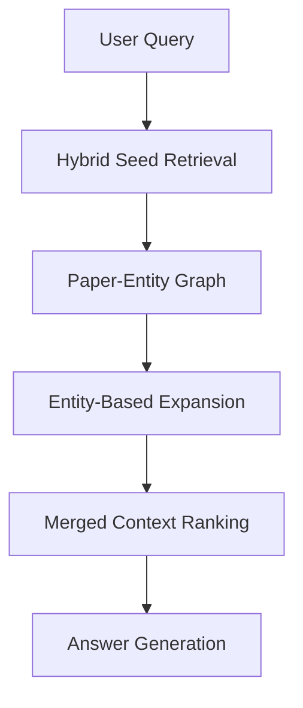

# GraphRAG

Notebook: `notebooks/06_graphrag.ipynb`

Executed notebook: `notebooks/06_graphrag.executed.ipynb`

Artifact: `artifacts/rag_v2/graphrag/06_graphrag_metrics.json`

---

## What Is This Technique?

GraphRAG augments retrieval with graph structure: documents are linked through entities/themes, and those links are used to expand context beyond nearest-neighbor similarity.

### Definition and Core Concepts

- **Seed retrieval:** retrieve top documents from a base retriever.
- **Graph construction:** represent document-entity connections.
- **Graph expansion:** traverse linked nodes to collect additional evidence.
- **Merged ranking:** combine seed and expanded evidence for generation.

### Why Was It Developed?

Top-k similarity retrieval can miss supporting evidence that is relevant through relationships, not direct vector proximity.

### What Traditional RAG Limitation Does It Solve?

It addresses single-hop retrieval blindness by introducing relation-aware context expansion.

---

## Architecture and Workflow

### Diagram Explanation

- The query first retrieves seed chunks.
- Seed papers activate connected entities in the graph.
- Entity-neighbor papers are added as candidate evidence.
- Final context is deduplicated and ranked for downstream use.

---

## Component-by-Component Breakdown

1. **Seed Retriever**
   - Hybrid retriever over existing FAISS+BM25 corpus.
2. **Graph Builder**
   - Deterministic lightweight entity extraction for scalability.
3. **Expansion Policy**
   - From seed papers to linked papers through entity overlap.
4. **Merge Layer**
   - Deduplicate and keep top-k context chunks.

---

## When Should It Be Used?

Use GraphRAG when:

- you need relationship-aware retrieval
- your tasks require synthesis over multiple documents
- your corpus has rich entity/theme structure

---

## Advantages and Disadvantages

### Advantages

- Better support for multi-document context synthesis.
- Makes inter-document relationships explicit.
- Strong base for graph-agent workflows.

### Disadvantages

- Added graph build/maintenance complexity.
- Extra tuning surface for expansion policy.
- Potentially higher memory/runtime costs at scale.

---

## Comparison vs Standard RAG and Other Variants

| Variant | Strength | Weakness |
|---|---|---|
| Standard RAG | Simplicity | Weak relational reasoning |
| Hybrid RAG | Better lexical+semantic balance | Still mostly local retrieval |
| GraphRAG | Relation-aware expansion | More system complexity |
| Agentic RAG | Dynamic routing | Requires orchestration logic |
| CRAG | Retrieval correction loop | Higher LLM-call latency |

GraphRAG is most useful when relation coverage matters more than pure top-k nearest-neighbor ranking.

---

## Implementation Details in This Project

- Graph built over reconstructed 4,000 paper-level records from chunk metadata.
- Deterministic entity extraction used to keep 4k-paper run practical.
- Expansion layered on top of Hybrid seed retrieval to preserve baseline quality.

---

## Real Run Results and Analysis

### Graph Statistics (Real)

| Metric | Value |
|---|---:|
| Paper nodes | 4000 |
| Entity nodes | 78 |
| Edges | 2644 |

### Retrieval Metrics (Real)

| Retriever | Recall@5 | Precision@5 | MRR | F1@5 | NDCG@5 | P50 ms | P95 ms | Queries |
|---|---:|---:|---:|---:|---:|---:|---:|---:|
| Hybrid | 0.0000 | 0.0000 | 0.0000 | 0.0000 | 0.0000 | 168.41 | 175.35 | 12 |
| GraphRAG | 0.0000 | 0.0000 | 0.0000 | 0.0000 | 0.0000 | 166.74 | 174.00 | 12 |

### Interpretation

1. Graph construction completed successfully at full 4,000-paper scale.
2. Retrieval metrics are flat under this weak-supervision evaluation setup.
3. Graph expansion did not increase latency materially versus Hybrid in this run.

### Why These Outputs Happened

- Weak relevance labels did not surface separable gains for graph expansion.
- Deterministic entity extraction produced a compact graph (78 entities), which keeps runtime low but may constrain expansion diversity.

---

## Lessons Learned and Practical Takeaways

1. GraphRAG value depends heavily on entity quality and label quality.
2. Relation-aware retrieval can be added with modest latency overhead.
3. To expose GraphRAG gains, use multi-hop, relation-dependent evaluation queries with stronger ground truth.

---

## Final Conclusion

GraphRAG is fully implemented and operational in this repository, including graph construction, expansion, and evaluation at 4,000-paper scale. The measured run confirms system correctness and scalability, while also showing that evaluation design is the current bottleneck for observing quantitative retrieval gains.
