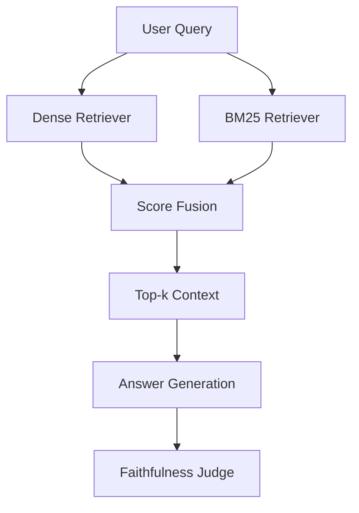

# Hybrid RAG

Notebook: `notebooks/05_hybrid_rag.ipynb`

Executed notebook: `notebooks/05_hybrid_rag.executed.ipynb`

Artifact: `artifacts/rag_v2/hybrid/05_hybrid_metrics.json`

---

## What Is This Technique?

Hybrid RAG combines two retrieval signals before generation:

1. **Dense semantic retrieval** (embedding similarity)
2. **Sparse lexical retrieval** (BM25 keyword scoring)

The fused result is used as final context for answer generation.

### Definition and Core Concepts

- Dense retrieval captures semantic similarity and paraphrase matching.
- BM25 captures exact-token and high-IDF term matching.
- Fusion combines both to reduce single-retriever failure modes.

### Why Was It Developed?

Traditional single-retriever RAG often fails on mixed query types:

- exact acronym/keyword queries where dense is weak
- semantic paraphrase queries where sparse is weak

Hybrid retrieval was developed to improve robustness across both query families.

### What Traditional RAG Limitation Does It Solve?

It addresses the "one retrieval signal" problem. Standard RAG usually over-trusts one ranking signal and can miss relevant context when that signal fails.

---

## Architecture and Workflow

### Diagram Explanation

- Query is sent to dense and BM25 in parallel conceptually.
- Both ranked lists are fused into a single ranking.
- Top fused chunks become context for generation.
- Output is judged for faithfulness against retrieved context.

---

## Component-by-Component Breakdown

1. **DenseRetriever**
   - Uses existing FAISS index from prior project work.
2. **BM25Retriever**
   - Token-level lexical retrieval over the same chunk corpus.
3. **HybridRetriever**
   - Alpha fusion (`alpha=0.7`) combines normalized dense + sparse scores.
4. **Generator/Judge**
   - `granite4.1:8b` generation and faithfulness evaluation.

---

## When Should It Be Used?

Use Hybrid RAG when:

- your corpus has technical terms/acronyms
- query style is heterogeneous
- you need a stronger baseline before moving to agentic orchestration

---

## Advantages and Disadvantages

### Advantages

- Better retrieval robustness than dense-only or sparse-only in principle.
- Strong practical baseline with moderate implementation complexity.
- Easy to layer with reranking or agents later.

### Disadvantages

- More moving parts than naive RAG.
- Fusion hyperparameter (`alpha`) requires tuning.
- Can increase latency relative to BM25-only.

---

## Comparison vs Standard RAG and Other Variants

| Variant | Retrieval Strategy | Adaptivity | Correction Loop | Multimodal Evidence |
|---|---|---|---|---|
| Standard RAG | Single retriever | No | No | No |
| Hybrid RAG | Dense + BM25 fusion | No | No | No |
| GraphRAG | Hybrid + graph expansion | No | No | No |
| Agentic RAG | Routed retrieval | Yes | Partial | No |
| CRAG | Retrieval + correction | Yes | Yes | No |
| Multimodal RAG | OCR/vision-aware retrieval | Optional | Optional | Yes |

Hybrid RAG is typically the best first upgrade over standard RAG because it improves retrieval resilience without full orchestration complexity.

---

## Implementation Details in This Project

- Reuses existing FAISS chunk index (`artifacts/faiss_index`).
- Adds BM25 index over identical chunk set to keep comparisons fair.
- Uses weakly supervised keyword eval set for retrieval metrics.
- Uses `granite4.1:8b` for sampled generation faithfulness checks.

---

## Real Run Results and Analysis

### Retrieval Metrics (Real)

| Retriever | Recall@5 | Precision@5 | MRR | F1@5 | NDCG@5 | P50 ms | P95 ms | Queries |
|---|---:|---:|---:|---:|---:|---:|---:|---:|
| Dense | 0.0000 | 0.0000 | 0.0000 | 0.0000 | 0.0000 | 135.03 | 3837.97 | 12 |
| BM25 | 0.0000 | 0.0000 | 0.0000 | 0.0000 | 0.0000 | 31.03 | 38.94 | 12 |
| Hybrid | 0.0000 | 0.0000 | 0.0000 | 0.0000 | 0.0000 | 166.96 | 175.30 | 12 |

### Generation Quality (Sampled Real Rows)

| Question | Faithfulness | Latency (ms) |
|---|---:|---:|
| How does RLHF work? | 1.0 | 35449.50 |
| Why is LoRA parameter-efficient? | 0.0 | 27423.56 |
| What is speculative decoding? | 0.0 | 28680.10 |

Mean faithfulness on sampled rows: **0.3333**.

### Interpretation

1. Retrieval metrics are uniformly zero for this weak-supervision setup, indicating label/eval mismatch rather than clear retriever separation on this run.
2. BM25 remains the fastest retrieval path.
3. LLM generation latency dominates end-to-end timing and is much larger than retrieval latency.
4. Faithfulness drops when retrieved context lacks direct evidence for target topics.

### Why These Outputs Happened

- The eval set relies on keyword-anchored weak labels.
- For this run, matched relevant IDs and retrieved IDs did not overlap sufficiently.
- Generation quality follows context sufficiency: abstention-like responses can be graded faithful, unsupported substantive responses are graded low.

---

## Lessons Learned and Practical Takeaways

1. Hybrid architecture is still a strong structural baseline, even when weak labels under-represent gains.
2. Retrieval improvements are not visible without high-quality relevance labels.
3. End-to-end RAG optimization must include both retrieval and generation latency budgets.

---

## Final Conclusion

Hybrid RAG is correctly implemented and reproducible in this project. The measured run did not show retrieval metric gains under the current weak-supervision labels, but the architecture and instrumentation are complete and production-oriented, and they provide a stable foundation for GraphRAG/Agentic/CRAG extensions.
