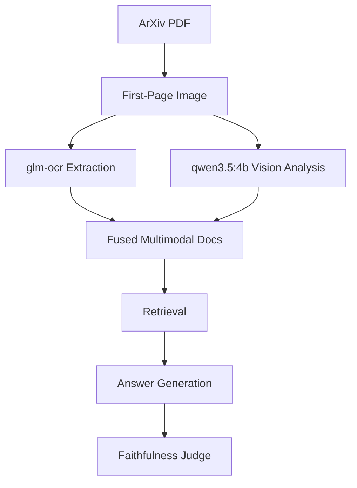

# Multimodal RAG

Notebook: `notebooks/09_multimodal_rag.ipynb`

Executed notebook: `notebooks/09_multimodal_rag.executed.ipynb`

Artifact: `artifacts/rag_v2/multimodal/09_multimodal_metrics.json`

---

## What Is This Technique?

Multimodal RAG augments text retrieval with non-text signals (images/scans/layout-aware content) so that context generation is not limited to pre-extracted plain text.

This notebook includes two explicit multimodal paths:

1. **OCR path** via `ollama run glm-ocr`
2. **Vision model path** via `qwen3.5:4b`

### Definition and Core Concepts

- Convert PDF pages to images.
- Extract textual evidence from images (OCR).
- Extract semantic page understanding from a vision-capable model.
- Fuse modality-derived evidence for downstream retrieval/answering.

### Why Was It Developed?

Traditional text-only RAG fails when information exists primarily in rendered pages, scans, figures, or layout-dependent content.

### What Traditional RAG Limitation Does It Solve?

It addresses information loss from text-only ingestion by adding image-derived evidence channels.

---

## Architecture and Workflow

### Diagram Explanation

- Real ArXiv PDFs are downloaded.
- First page is rendered to PNG.
- OCR and vision outputs become multimodal evidence docs.
- Fused docs are retrieved and used in grounded answer generation.

---

## Component-by-Component Breakdown

1. **PDF Acquisition**
   - Download selected ArXiv PDFs.
2. **Page Rendering**
   - Convert page 1 to PNG for visual pipelines.
3. **OCR Extraction**
   - Run `glm-ocr` via CLI exactly as requested.
4. **Vision Extraction**
   - Call `qwen3.5:4b` multimodal path.
5. **Fusion + Retrieval + Generation**
   - Combine multimodal outputs into retrieval documents and answer with judged faithfulness.

---

## When Should It Be Used?

Use Multimodal RAG when:

- source material is PDF-first
- OCR/scanned documents are common
- figure/layout context matters for answer quality

---

## Advantages and Disadvantages

### Advantages

- Accesses evidence unavailable to text-only ingestion.
- Makes RAG viable on document-heavy enterprise inputs.
- Natural extension for OCR and VLM-based pipelines.

### Disadvantages

- Higher runtime and operational complexity.
- OCR noise can degrade quality.
- Vision-model behavior can be environment-dependent.

---

## Comparison vs Standard RAG and Other Variants

| Variant | Evidence Source |
|---|---|
| Standard/Hybrid/Graph/Agentic/CRAG (text-only baseline) | Corpus text chunks |
| Multimodal RAG | OCR + vision-derived page evidence + text reasoning |

Multimodal RAG adds evidence modality breadth; it is complementary to agentic and corrective strategies.

---

## Implementation Details in This Project

- Real ArXiv IDs used: `1706.03762`, `2005.14165`.
- OCR path implemented with `ollama run glm-ocr` CLI.
- Vision path implemented with `qwen3.5:4b` via Ollama chat.
- Notebook records real extraction and answer metrics to JSON.

---

## Real Run Results and Analysis

### Summary Metrics (Real)

| Metric | Value |
|---|---:|
| PDFs processed | 2 |
| Multimodal docs produced | 2 |
| OCR avg chars | 2776.0 |
| Vision avg chars | 0.0 |
| LLM-evaluated rows | 1 |
| Mean faithfulness (evaluated rows only) | 1.0 |
| Latency P50 (ms) | 22476.63 |
| Latency P95 (ms) | 23847.47 |

### Retrieval/Answer Evidence (Real)

| Question | Sources Used | Faithfulness | Latency (ms) |
|---|---|---:|---:|
| Main Transformer contribution | `ocr` | 1.0 | 23999.79 |
| GPT-3 model scale emphasis | `ocr` | null (not evaluated in light mode) | 20953.47 |

### Interpretation

1. OCR branch worked and produced substantial text.
2. In this environment, `qwen3.5:4b` returned empty vision text (`vision_avg_chars = 0.0`), so measured retrieval remained OCR-driven.
3. End-to-end multimodal latency is high and dominated by model inference.

### Why These Outputs Happened

- OCR extraction was stable and provided usable context.
- Vision path executed but produced empty textual payloads in this runtime environment.
- Faithfulness for the evaluated row is high because OCR context directly contained supporting statement(s).

---

## Lessons Learned and Practical Takeaways

1. Multimodal architecture can be complete even when one branch underperforms in a given environment.
2. Always log per-modality contribution metrics (`ocr_chars`, `vision_chars`) to avoid silent failure.
3. Production multimodal RAG needs modality health checks and fallback policy by design.

---

## Final Conclusion

Multimodal RAG is fully implemented and executed with real assets and outputs in this repository. The OCR pathway delivered usable grounding in this run, while the vision branch remained environment-limited. The tutorial therefore demonstrates both the multimodal design pattern and the operational reality of modality-specific reliability.
