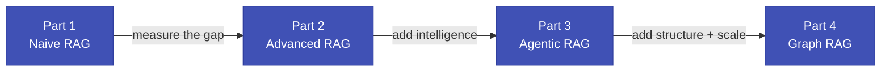

# Agentic RAG — Zero to Hero

**Build a fully local, production-grade RAG research assistant on a 4,000-paper ArXiv ML/AI baseline, while preserving legacy 600-paper results for direct comparison.**

No cloud APIs. No API keys. No paid services. Everything runs on your machine.

---

## What is this project?

This tutorial teaches you how to build a **Retrieval-Augmented Generation (RAG)** system
end-to-end. You build four progressively more capable systems, measure each one, and
compare behavior at two scales:

- **Current baseline:** 4,000-paper corpus
- **Historical baseline:** 600-paper corpus (kept as legacy artifacts)

Ask questions like:

- *"What is retrieval-augmented generation and how does it work?"*
- *"How does LoRA reduce memory consumption during fine-tuning?"*
- *"What are the key differences between BM25 and dense retrieval?"*

By the end, you have a complete progression from naive dense retrieval to graph-aware and
agentic GraphRAG with reproducible benchmark artifacts.

---

## The learning journey



| Part | Notebook | What you build | Key metric |
|------|----------|----------------|------------|
| **1 — Naive RAG** | `01_naive_rag.ipynb` | FAISS semantic search + generation baseline | 4,000-run metric output in `01_naive_rag_4000.json` |
| **2 — Advanced RAG** | `02_advanced_rag.ipynb` | BM25 + hybrid retrieval + reranking | 4,000-run metric output in `02_advanced_rag_4000.json` |
| **3 — Agentic RAG** | `03_agentic_rag_langgraph.ipynb` | LangGraph CRAG over the 4,000 baseline | 4,000-run metric output in `03_agentic_rag_4000.json` |
| **4 — Graph RAG** | `04_graph_rag.ipynb` | ChromaDB + Pinecone + Agentic GraphRAG | 4,000-run outputs in `04_*_4000.json` |

Each part builds on the previous one. Legacy 600 artifacts remain under
`artifacts/eval_results/legacy_600/` so readers can compare small-vs-large corpus behavior.

---

## Quick start

If you want to jump straight in, here are the three commands to go from a fresh clone to a running notebook environment:

```bash
# 1 — Clone and enter the repo
git clone https://github.com/pypi-ahmad/agentic-rag-arxiv-research-assistant.git
cd agentic-rag-arxiv-research-assistant

# 2 — Set up the Python environment (requires uv)
uv venv --python 3.13 && source .venv/bin/activate && uv pip install -r requirements.txt

# 3 — Register the Jupyter kernel and open notebooks
.venv/bin/python -m ipykernel install --user --name agentic-rag-env --display-name "Agentic RAG"
jupyter notebook
```

!!! warning "Pull the models first"
    The notebooks call Ollama for embeddings and LLM generation. Before running any notebook, make sure you have pulled the models:

    ```bash
    ollama pull qwen3-embedding:0.6b
    ollama pull granite4.1:8b
    ```

    If Ollama is not installed yet, see the [Prerequisites](01_getting_started/prerequisites.md) page.

---

## What each part builds

### Part 1 — Naive RAG (Notebook 01)

Build the baseline FAISS pipeline over a 4,000-paper HuggingFace-backed corpus and
generate retrieval metrics.

**New concepts:** embeddings, cosine similarity, FAISS, chunking, RAG prompt design, Recall@k, Precision@k, MRR.

### Part 2 — Advanced RAG (Notebook 02)

You add a BM25 keyword retriever alongside the dense FAISS retriever, combine their scores (hybrid search), and add a cross-encoder reranker as a second-pass filter. You measure each component in isolation to understand which one actually moved the needle.

**New concepts:** BM25 scoring, hybrid retrieval, alpha-weighted score fusion, RRF, bi-encoder vs. cross-encoder, two-stage retrieve-then-rerank.

### Part 3 — Agentic RAG (Notebook 03)

You implement the CRAG architecture (Corrective RAG, Yan et al. 2024) as a LangGraph state machine. The agent grades retrieved documents for relevance, falls back to DuckDuckGo web search when the corpus can't help, generates an answer, then grades its own answer for hallucinations — retrying up to twice if it detects a problem.

**New concepts:** state machines, LangGraph TypedDict state, conditional edges, LLM-as-judge, CRAG architecture, web search tool.

### Part 4 — Graph RAG (Notebook 04)

Move from chunk-only retrieval to entity/community-aware retrieval:

- GraphRAG on ChromaDB
- GraphRAG on Pinecone
- Agentic GraphRAG with LangGraph routing

and evaluate all three under the same 4,000-paper benchmark.

---

## How the docs relate to the notebooks

!!! info "Docs explain the *why*. Notebooks are the runnable code."
    Every concept in these docs has a corresponding cell in a notebook. The docs give you the intuition and the mental model; the notebooks let you run the code and see the numbers yourself.

    If something in a notebook is unclear, come back to the docs for the deeper explanation. If a docs page feels abstract, open the corresponding notebook cell and run it.

---

## Who this is for

This tutorial is for you if:

- You are a Python developer or ML practitioner who has heard about RAG but never built one from scratch
- You understand what a neural network does at a high level, but don't need a PhD-level treatment
- You want to see real, measured improvements — not just "here's some code that might work"
- You want everything to run locally, without paying for API calls or setting up cloud infrastructure

You do **not** need prior experience with RAG, LangChain, LangGraph, FAISS, or BM25. Everything is explained from scratch.

---

## Ready to begin?

Start with [What Is This Project](01_getting_started/what_is_this_project.md) for the full context and motivation, or jump straight to [Prerequisites](01_getting_started/prerequisites.md) if you're already sold on the idea.
